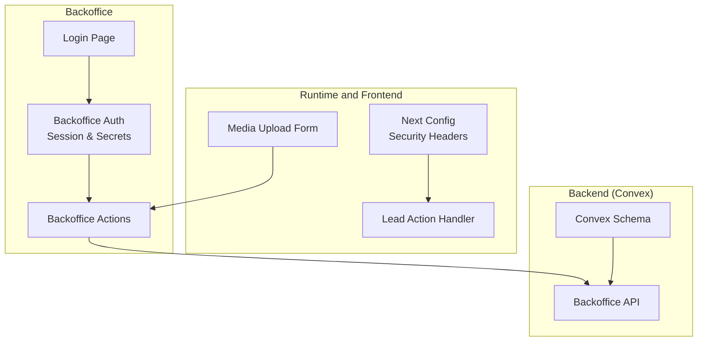
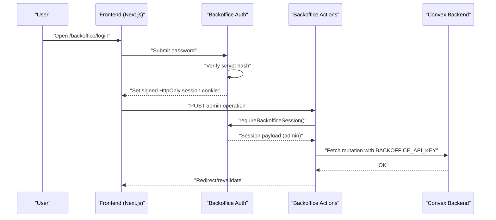
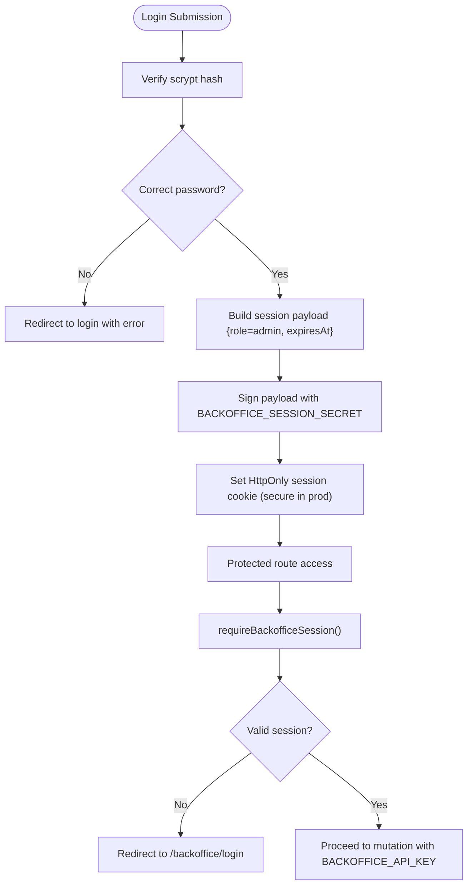
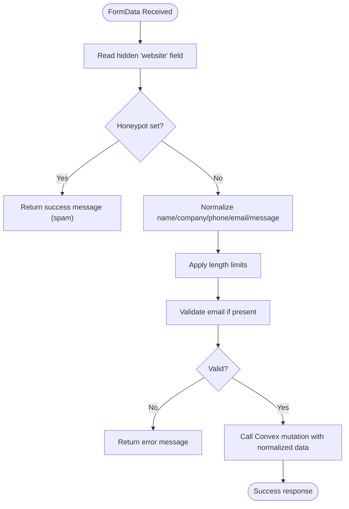
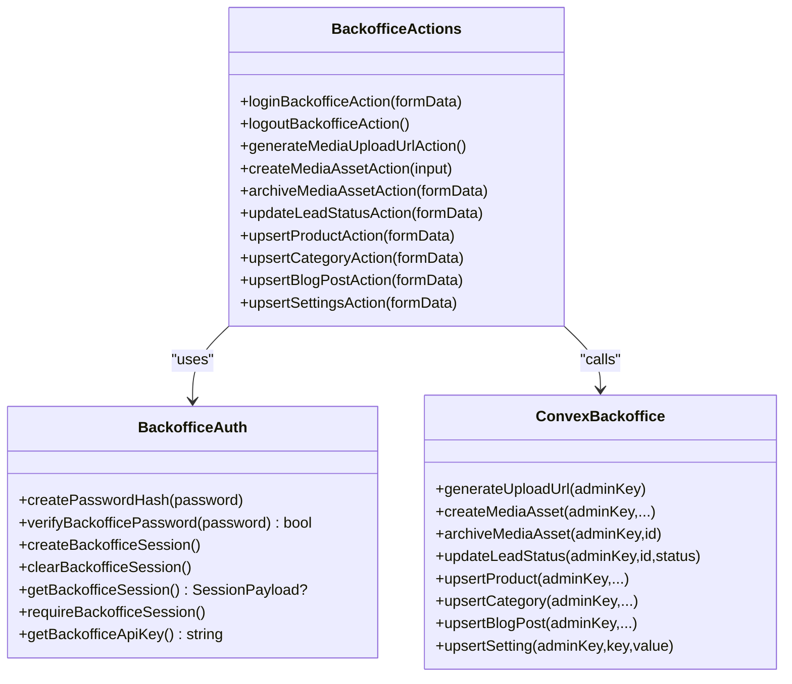
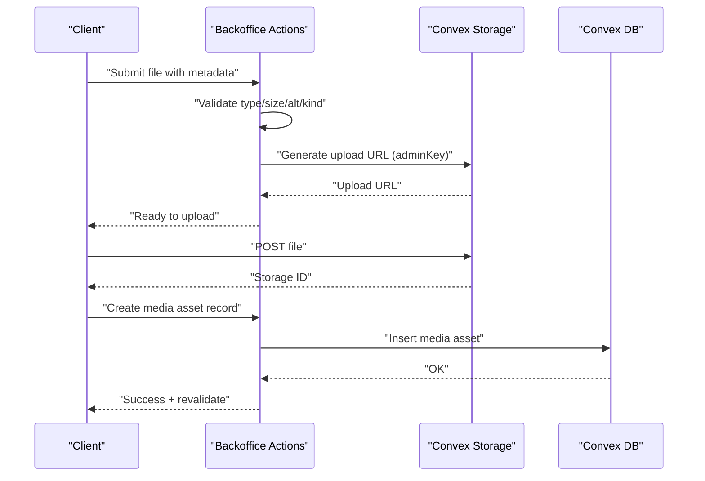
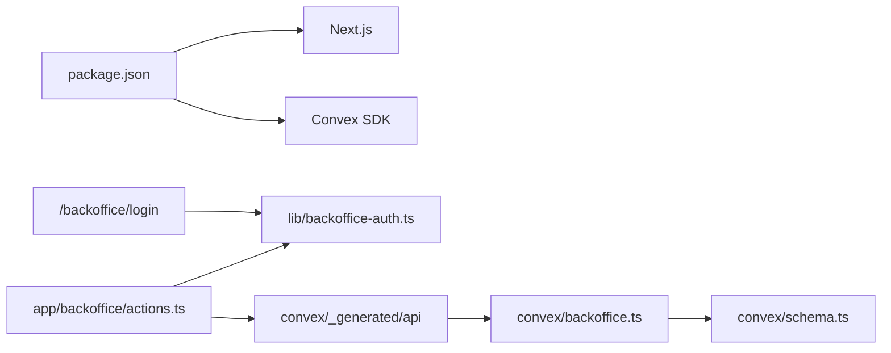

# Security Implementation

<cite>
**Referenced Files in This Document**
- [SECURITY.md](file://docs/SECURITY.md)
- [next.config.ts](file://next.config.ts)
- [backoffice-auth.ts](file://lib/backoffice-auth.ts)
- [actions.ts](file://app/backoffice/actions.ts)
- [login/page.tsx](file://app/backoffice/login/page.tsx)
- [media-upload-form.tsx](file://components/backoffice/media-upload-form.tsx)
- [lead-actions.ts](file://app/actions/lead-actions.ts)
- [backoffice.ts](file://convex/backoffice.ts)
- [schema.ts](file://convex/schema.ts)
- [package.json](file://package.json)
</cite>

## Table of Contents
1. [Introduction](#introduction)
2. [Project Structure](#project-structure)
3. [Core Components](#core-components)
4. [Architecture Overview](#architecture-overview)
5. [Detailed Component Analysis](#detailed-component-analysis)
6. [Dependency Analysis](#dependency-analysis)
7. [Performance Considerations](#performance-considerations)
8. [Troubleshooting Guide](#troubleshooting-guide)
9. [Conclusion](#conclusion)
10. [Appendices](#appendices)

## Introduction
This document details the security implementation for the ADIKI ALVANIR Angola website. The site is intentionally low-risk: it is a static institutional website without user accounts, shopping carts, or online payments. Security focuses on hardening the runtime, protecting the administrative backoffice, validating and sanitizing inputs, controlling file uploads, and ensuring secure communication. The document also outlines environment variable management, secrets handling, and operational guidance for production.

## Project Structure
Security-relevant areas of the codebase include:
- Runtime hardening via Next.js headers and CSP
- Administrative authentication and session management
- Server actions for backoffice operations
- Frontend forms with input normalization and limits
- Convex schema and server-side validation
- Media upload pipeline with client-side checks and server enforcement

**Diagram sources**
- [next.config.ts:27-90](file://next.config.ts#L27-L90)
- [lead-actions.ts:1-96](file://app/actions/lead-actions.ts#L1-L96)
- [media-upload-form.tsx:1-114](file://components/backoffice/media-upload-form.tsx#L1-L114)
- [backoffice-auth.ts:1-129](file://lib/backoffice-auth.ts#L1-L129)
- [actions.ts:1-215](file://app/backoffice/actions.ts#L1-L215)
- [login/page.tsx:1-69](file://app/backoffice/login/page.tsx#L1-L69)
- [backoffice.ts:1-385](file://convex/backoffice.ts#L1-L385)
- [schema.ts:1-87](file://convex/schema.ts#L1-L87)

**Section sources**
- [next.config.ts:27-90](file://next.config.ts#L27-L90)
- [SECURITY.md:1-29](file://docs/SECURITY.md#L1-L29)

## Core Components
- Runtime hardening: Content-Security-Policy, HSTS, X-Frame-Options, Referrer-Policy, Permissions-Policy, COOP/ CORP, and powered-by removal.
- Backoffice authentication: Password hashing with scrypt, HMAC-signed session cookie, HttpOnly and SameSite/lax, expiration, and API key gating.
- Input validation and sanitization: Length limits, single-line normalization, email validation, and honeypot spam defense.
- File upload controls: Client-side type and size checks plus server-side enforcement and Convex Storage usage.
- Authorization: Role-based access (admin) enforced by session and Convex admin key.
- Environment variables and secrets: Session secret, password hash, and admin API key loaded from environment.

**Section sources**
- [next.config.ts:27-90](file://next.config.ts#L27-L90)
- [backoffice-auth.ts:1-129](file://lib/backoffice-auth.ts#L1-L129)
- [actions.ts:1-215](file://app/backoffice/actions.ts#L1-L215)
- [lead-actions.ts:1-96](file://app/actions/lead-actions.ts#L1-L96)
- [media-upload-form.tsx:1-114](file://components/backoffice/media-upload-form.tsx#L1-L114)
- [backoffice.ts:25-31](file://convex/backoffice.ts#L25-L31)

## Architecture Overview
The security architecture combines client-side safeguards, server-side validation, and backend authorization.

**Diagram sources**
- [login/page.tsx:17-68](file://app/backoffice/login/page.tsx#L17-L68)
- [backoffice-auth.ts:60-118](file://lib/backoffice-auth.ts#L60-L118)
- [actions.ts:63-77](file://app/backoffice/actions.ts#L63-L77)
- [backoffice.ts:68-74](file://convex/backoffice.ts#L68-L74)

## Detailed Component Analysis

### Session-Based Authentication System
- Password handling: Stored as scrypt hash with salt; verification uses constant-time comparison.
- Session cookie: Base64URL-encoded payload signed with HMAC-SHA256; HttpOnly, SameSite lax, secure in production; expires after a fixed window.
- Session retrieval: Verifies signature and payload validity; rejects expired or malformed sessions.
- API access: All backoffice mutations require a valid session and a server-side admin API key.

**Diagram sources**
- [backoffice-auth.ts:41-58](file://lib/backoffice-auth.ts#L41-L58)
- [backoffice-auth.ts:60-76](file://lib/backoffice-auth.ts#L60-L76)
- [backoffice-auth.ts:83-108](file://lib/backoffice-auth.ts#L83-L108)
- [actions.ts:63-72](file://app/backoffice/actions.ts#L63-L72)
- [backoffice.ts:25-31](file://convex/backoffice.ts#L25-L31)

**Section sources**
- [backoffice-auth.ts:1-129](file://lib/backoffice-auth.ts#L1-L129)
- [actions.ts:63-77](file://app/backoffice/actions.ts#L63-L77)
- [login/page.tsx:17-68](file://app/backoffice/login/page.tsx#L17-L68)
- [backoffice.ts:25-31](file://convex/backoffice.ts#L25-L31)

### Input Validation and Sanitization
- Lead form normalization:
  - Single-line normalization trims and collapses whitespace.
  - Message normalization standardizes line breaks and limits repeated blank lines.
  - Email validation uses a basic regex; invalid emails are rejected.
  - Length limits applied to all fields.
  - Hidden honeypot field silently captures bot submissions.
- Backoffice actions:
  - Trims and normalizes strings; validates numeric and timestamp fields; enforces length caps for identifiers and metadata.
  - Slug generation uses a controlled normalization pipeline.

**Diagram sources**
- [lead-actions.ts:32-95](file://app/actions/lead-actions.ts#L32-L95)
- [actions.ts:16-51](file://app/backoffice/actions.ts#L16-L51)

**Section sources**
- [lead-actions.ts:1-96](file://app/actions/lead-actions.ts#L1-L96)
- [actions.ts:16-51](file://app/backoffice/actions.ts#L16-L51)

### CSRF Protection and Form Security
- CSRF mitigation:
  - Session-based CSRF protection: All administrative actions require a valid signed session cookie.
  - Admin API key: Convex mutations require a server-side admin key, adding a second factor for authorization.
- Additional protections:
  - Strict Content-Security-Policy restricts script, frame, and connect sources.
  - HSTS ensures HTTPS-only transport in production.
  - X-Frame-Options and frame-ancestors prevent clickjacking.
  - Referrer-Policy and Permissions-Policy reduce fingerprinting and sensor access.

Note: There is no explicit anti-CSRF token per form submission because session cookies and admin keys provide layered authorization. Forms are restricted to internal endpoints and external integrations (WhatsApp) are constrained by CSP and form-action directives.

**Section sources**
- [backoffice-auth.ts:60-76](file://lib/backoffice-auth.ts#L60-L76)
- [backoffice.ts:68-74](file://convex/backoffice.ts#L68-L74)
- [next.config.ts:27-61](file://next.config.ts#L27-L61)
- [SECURITY.md:5-15](file://docs/SECURITY.md#L5-L15)

### Authorization Patterns and Role-Based Access Control
- Role model: Admin-only access to backoffice routes and mutations.
- Enforcement:
  - Session verification ensures only admin role can proceed.
  - Convex functions enforce admin key requirement server-side.
  - Revalidation clears cached public content after admin updates.

**Diagram sources**
- [backoffice-auth.ts:1-129](file://lib/backoffice-auth.ts#L1-L129)
- [actions.ts:1-215](file://app/backoffice/actions.ts#L1-L215)
- [backoffice.ts:68-317](file://convex/backoffice.ts#L68-L317)

**Section sources**
- [backoffice-auth.ts:9-12](file://lib/backoffice-auth.ts#L9-L12)
- [backoffice-auth.ts:110-118](file://lib/backoffice-auth.ts#L110-L118)
- [backoffice.ts:25-31](file://convex/backoffice.ts#L25-L31)

### Environment Variable Management and Secret Handling
- Required secrets:
  - BACKOFFICE_SESSION_SECRET: Used to sign session payloads.
  - BACKOFFICE_PASSWORD_HASH: Server-side scrypt hash of the admin password.
  - BACKOFFICE_API_KEY: Server-side admin key for Convex mutations.
  - NEXT_PUBLIC_CONVEX_URL: Frontend Convex endpoint (public).
- Production guidance:
  - Ensure secrets are set in the deployment environment.
  - Do not commit secrets to version control.
  - Rotate secrets periodically and update deployments atomically.

**Section sources**
- [backoffice-auth.ts:18-25](file://lib/backoffice-auth.ts#L18-L25)
- [backoffice-auth.ts:41-47](file://lib/backoffice-auth.ts#L41-L47)
- [backoffice-auth.ts:120-128](file://lib/backoffice-auth.ts#L120-L128)
- [lead-actions.ts:44-49](file://app/actions/lead-actions.ts#L44-L49)
- [SECURITY.md:17-23](file://docs/SECURITY.md#L17-L23)

### File Uploads, Media Asset Management, and Content Validation
- Client-side checks:
  - Allowed types: JPEG, PNG, WebP.
  - Max size: 5 MB.
  - Alt text and kind selection are validated and trimmed.
- Server-side enforcement:
  - Convex generates a short-lived upload URL.
  - Mutation records asset metadata and status.
  - Only approved public content returns image URLs to visitors.
- Storage:
  - Assets stored in Convex Storage; URLs generated server-side.

**Diagram sources**
- [media-upload-form.tsx:14-77](file://components/backoffice/media-upload-form.tsx#L14-L77)
- [actions.ts:79-108](file://app/backoffice/actions.ts#L79-L108)
- [backoffice.ts:68-100](file://convex/backoffice.ts#L68-L100)

**Section sources**
- [media-upload-form.tsx:11-12](file://components/backoffice/media-upload-form.tsx#L11-L12)
- [actions.ts:79-108](file://app/backoffice/actions.ts#L79-L108)
- [backoffice.ts:33-52](file://convex/backoffice.ts#L33-L52)

### Rate Limiting and Abuse Prevention
- Current measures:
  - No explicit rate limiter in the codebase.
  - Anti-spam via honeypot field in the lead form.
  - CSP and form-action restrictions limit outbound form submissions.
- Recommended mitigations (not currently implemented):
  - Add rate limiting at the Convex function level or reverse proxy.
  - Introduce CAPTCHA for lead submissions.
  - Monitor lead creation metrics and apply adaptive throttling.

**Section sources**
- [lead-actions.ts:35-42](file://app/actions/lead-actions.ts#L35-L42)
- [next.config.ts:20](file://next.config.ts#L20)
- [SECURITY.md:19-23](file://docs/SECURITY.md#L19-L23)

### Audit Logging and Security Monitoring
- Observability:
  - Convex logs are available in the Convex dashboard.
  - Consider adding structured logs for admin actions and anomalies.
- Monitoring recommendations (not currently implemented):
  - Track failed login attempts and blocked submissions.
  - Alert on unusual spikes in lead submissions or media uploads.
  - Integrate with a SIEM or log aggregation platform.

**Section sources**
- [backoffice.ts:120-144](file://convex/backoffice.ts#L120-L144)
- [SECURITY.md:19-23](file://docs/SECURITY.md#L19-L23)

### Data Encryption Strategies
- Transport encryption:
  - HSTS ensures HTTPS-only transport in production.
- At-rest encryption:
  - Convex Storage encrypts uploaded assets.
- In-transit encryption:
  - All internal connections to Convex use HTTPS.
- Credential protection:
  - Passwords hashed with scrypt; session secret and admin key stored in environment variables.

**Section sources**
- [next.config.ts:33-34](file://next.config.ts#L33-L34)
- [backoffice-auth.ts:35-39](file://lib/backoffice-auth.ts#L35-L39)
- [backoffice.ts:68-74](file://convex/backoffice.ts#L68-L74)

### Secure Data Transmission
- Headers:
  - Strict-Transport-Security, X-Content-Type-Options, X-Frame-Options, Referrer-Policy, Permissions-Policy, COOP/CORP.
- CSP:
  - Restricts script, connect, frame, and form-action origins.
- Images:
  - Remote images allowed only from trusted Convex hosts.

**Section sources**
- [next.config.ts:27-61](file://next.config.ts#L27-L61)
- [SECURITY.md:7-15](file://docs/SECURITY.md#L7-L15)

### Security Testing and Vulnerability Assessment
- Static analysis:
  - TypeScript type checking and ESLint rules.
- Dependency auditing:
  - Regularly audit and update dependencies before deploying.
- Manual testing:
  - Test login flow, session expiration, and admin-only routes.
  - Validate file upload constraints and Convex mutation permissions.
- Automated scanning:
  - Use SAST and SCA tools during CI/CD.
- Penetration testing:
  - Periodically engage third-party testers for authenticated and unauthenticated scenarios.

**Section sources**
- [package.json:14-50](file://package.json#L14-L50)
- [SECURITY.md:23](file://docs/SECURITY.md#L23)

### Incident Response and Security Update Management
- Immediate actions:
  - Rotate compromised secrets (session secret, admin key, password hash).
  - Revoke and regenerate Convex admin key.
  - Review Convex logs for suspicious activity.
- Communication:
  - Notify stakeholders and document the incident.
- Remediation:
  - Apply patches and re-audit dependencies.
  - Re-enable services after validation.
- Post-mortem:
  - Analyze root cause and update procedures.

**Section sources**
- [backoffice-auth.ts:18-25](file://lib/backoffice-auth.ts#L18-L25)
- [backoffice-auth.ts:120-128](file://lib/backoffice-auth.ts#L120-L128)
- [SECURITY.md:17-23](file://docs/SECURITY.md#L17-L23)

## Dependency Analysis
- Frontend depends on Next.js runtime and Convex SDK.
- Backoffice actions depend on:
  - Session utilities for authentication and authorization.
  - Convex API for data persistence and storage.
- Convex schema defines data types and indexes; server-side functions enforce admin key and validate inputs.

**Diagram sources**
- [package.json:14-25](file://package.json#L14-L25)
- [login/page.tsx:4](file://app/backoffice/login/page.tsx#L4)
- [backoffice-auth.ts:1-129](file://lib/backoffice-auth.ts#L1-L129)
- [actions.ts:7-14](file://app/backoffice/actions.ts#L7-L14)
- [backoffice.ts:3](file://convex/backoffice.ts#L3)
- [schema.ts:1-5](file://convex/schema.ts#L1-L5)

**Section sources**
- [package.json:14-50](file://package.json#L14-L50)
- [actions.ts:7-14](file://app/backoffice/actions.ts#L7-L14)
- [backoffice.ts:3](file://convex/backoffice.ts#L3)
- [schema.ts:1-5](file://convex/schema.ts#L1-L5)

## Performance Considerations
- Session cookie size is minimal; HMAC signing overhead is negligible.
- Input normalization is lightweight and occurs on the server.
- Convex queries use indexes; avoid excessive fan-out operations.
- Media uploads leverage Convex Storage; keep file sizes within limits to reduce latency.

[No sources needed since this section provides general guidance]

## Troubleshooting Guide
- Login fails:
  - Ensure BACKOFFICE_PASSWORD_HASH is set and formatted correctly.
  - Confirm BACKOFFICE_SESSION_SECRET is configured.
- Session expires too soon or not at all:
  - Verify NODE_ENV and cookie secure flag behavior.
  - Check browser cookie settings and SameSite compatibility.
- Admin actions blocked:
  - Confirm BACKOFFICE_API_KEY is set and matches server expectations.
  - Ensure session exists and is unexpired.
- Upload errors:
  - Confirm file type and size constraints.
  - Verify Convex upload URL generation succeeds.
- Lead form issues:
  - Check NEXT_PUBLIC_CONVEX_URL presence.
  - Validate honeypot field remains empty.

**Section sources**
- [backoffice-auth.ts:41-58](file://lib/backoffice-auth.ts#L41-L58)
- [backoffice-auth.ts:18-25](file://lib/backoffice-auth.ts#L18-L25)
- [backoffice-auth.ts:120-128](file://lib/backoffice-auth.ts#L120-L128)
- [actions.ts:79-82](file://app/backoffice/actions.ts#L79-L82)
- [lead-actions.ts:44-49](file://app/actions/lead-actions.ts#L44-L49)
- [media-upload-form.tsx:26-42](file://components/backoffice/media-upload-form.tsx#L26-L42)

## Conclusion
The site employs a pragmatic, low-risk security posture: strong runtime hardening, robust backoffice authentication with secrets, strict input validation, and controlled file uploads. Administrative access is protected by session cookies and an admin API key. While there is no built-in rate limiting or centralized audit logging, the architecture supports straightforward additions for production hardening and observability.

[No sources needed since this section summarizes without analyzing specific files]

## Appendices

### Appendix A: Security Headers Overview
- Content-Security-Policy: Restrictive defaults with whitelisted Convex hosts and form-action targets.
- Strict-Transport-Security: Enforced in production.
- X-Frame-Options and frame-ancestors: Prevent clickjacking.
- X-Content-Type-Options: Mitigates MIME sniffing.
- Referrer-Policy: Limits leakage of referrers.
- Permissions-Policy: Blocks sensors and media APIs.
- Cross-Origin-Opener-Policy and Cross-Origin-Resource-Policy: Basic isolation.

**Section sources**
- [next.config.ts:8-25](file://next.config.ts#L8-L25)
- [next.config.ts:27-61](file://next.config.ts#L27-L61)
- [SECURITY.md:7-15](file://docs/SECURITY.md#L7-L15)