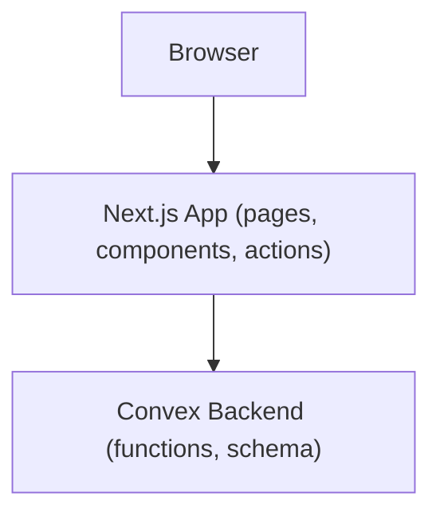
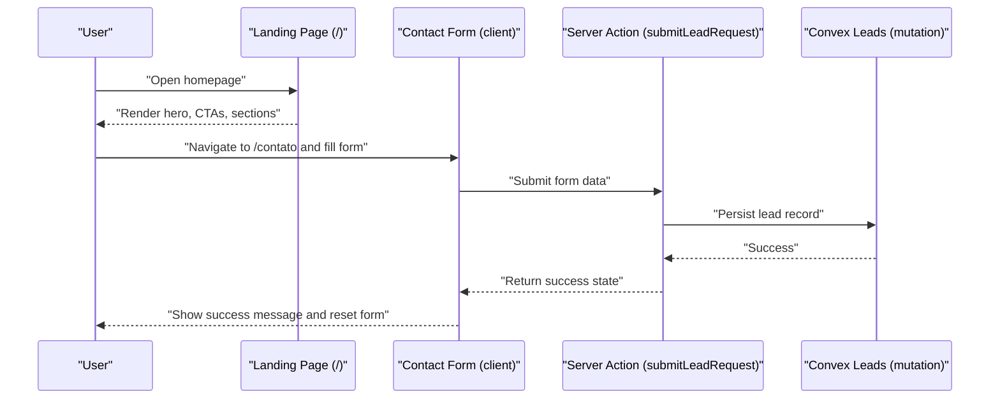
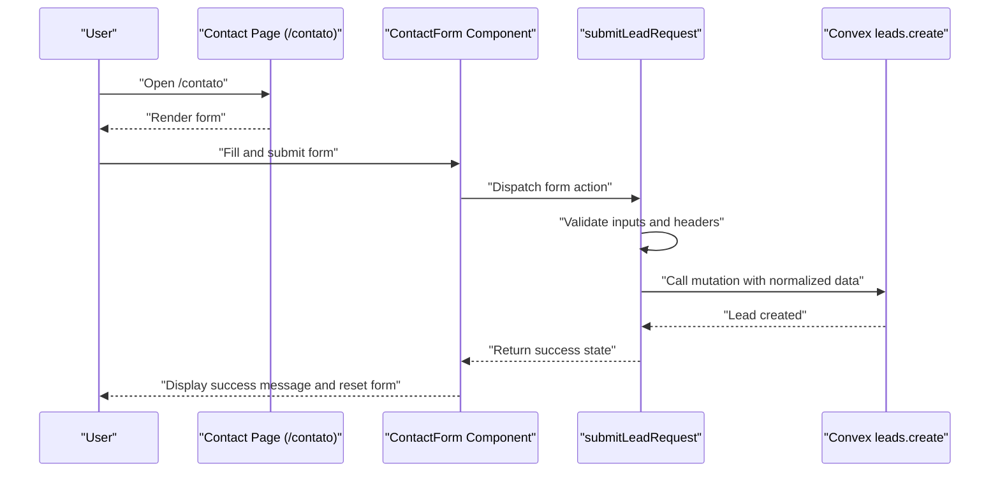
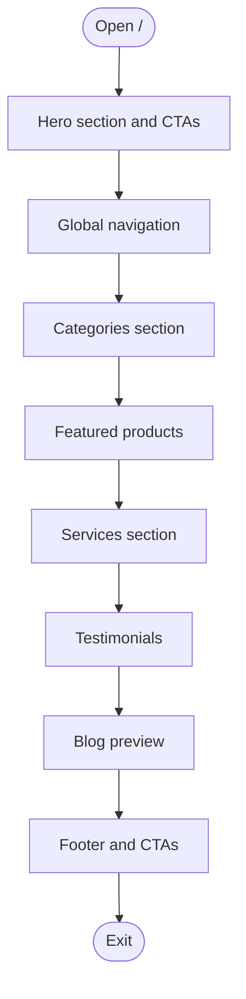
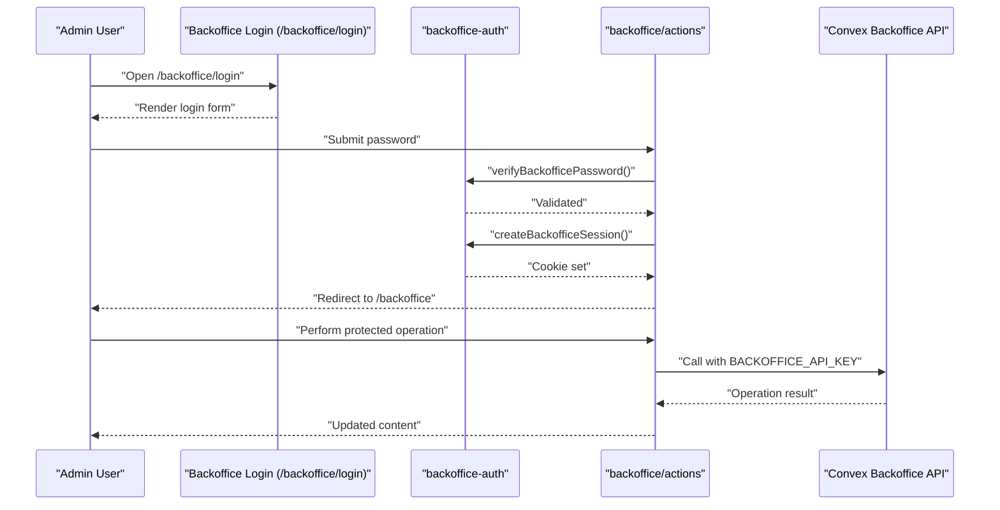
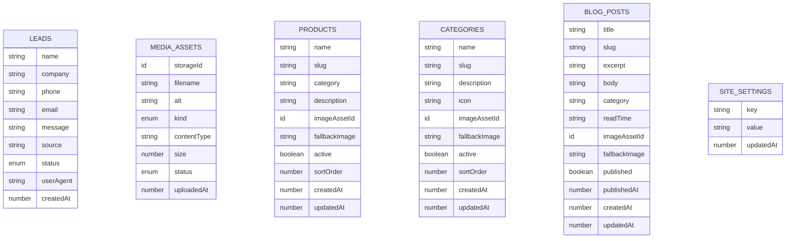
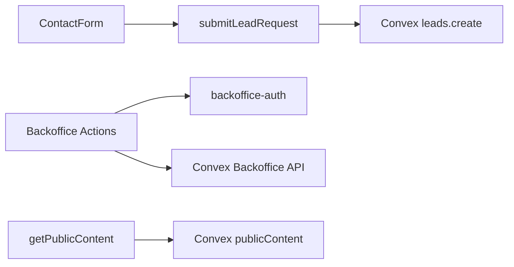

# End-to-End Testing

<cite>
**Referenced Files in This Document**
- [package.json](file://package.json)
- [app/layout.tsx](file://app/layout.tsx)
- [app/page.tsx](file://app/page.tsx)
- [app/contato/page.tsx](file://app/contato/page.tsx)
- [components/site/contact-form.tsx](file://components/site/contact-form.tsx)
- [app/actions/lead-actions.ts](file://app/actions/lead-actions.ts)
- [app/backoffice/login/page.tsx](file://app/backoffice/login/page.tsx)
- [app/backoffice/actions.ts](file://app/backoffice/actions.ts)
- [lib/backoffice-auth.ts](file://lib/backoffice-auth.ts)
- [lib/public-content.ts](file://lib/public-content.ts)
- [lib/site-data.ts](file://lib/site-data.ts)
- [convex/schema.ts](file://convex/schema.ts)
- [convex/leads.ts](file://convex/leads.ts)
- [docs/BACKOFFICE.md](file://docs/BACKOFFICE.md)
- [docs/CONVEX.md](file://docs/CONVEX.md)
</cite>

## Table of Contents
1. [Introduction](#introduction)
2. [Project Structure](#project-structure)
3. [Core Components](#core-components)
4. [Architecture Overview](#architecture-overview)
5. [Detailed Component Analysis](#detailed-component-analysis)
6. [Dependency Analysis](#dependency-analysis)
7. [Performance Considerations](#performance-considerations)
8. [Troubleshooting Guide](#troubleshooting-guide)
9. [Conclusion](#conclusion)
10. [Appendices](#appendices)

## Introduction
This document provides end-to-end testing guidance for the ADIKI ALVANIR Angola website. It focuses on validating critical user journeys: visiting the landing page, browsing content, submitting a lead via the contact form, and performing administrative operations in the backoffice. It also outlines browser automation approaches, cross-browser and responsive testing strategies, and best practices for visual regression, accessibility, and performance.

## Project Structure
The site is a Next.js application with a front-end built around pages and client components, server actions for form submissions, and a Convex backend for data persistence. Administrative features are protected by a session cookie and API key.

**Diagram sources**
- [app/page.tsx:30-311](file://app/page.tsx#L30-L311)
- [components/site/contact-form.tsx:17-91](file://components/site/contact-form.tsx#L17-L91)
- [app/actions/lead-actions.ts:32-95](file://app/actions/lead-actions.ts#L32-L95)
- [convex/schema.ts:4-86](file://convex/schema.ts#L4-L86)
- [convex/leads.ts:7-31](file://convex/leads.ts#L7-L31)

**Section sources**
- [package.json:1-51](file://package.json#L1-L51)
- [app/layout.tsx:1-104](file://app/layout.tsx#L1-L104)

## Core Components
- Landing page: renders hero, benefits, categories, featured products, services, testimonials, process visuals, and a call-to-action section.
- Contact form: client component that posts to a server action, which validates input and persists leads to Convex.
- Backoffice login and management: protected area secured by a signed session cookie and an API key; server actions manage media, products, categories, blog posts, and settings.

Key implementation references:
- Landing page rendering and navigation: [app/page.tsx:30-311](file://app/page.tsx#L30-L311)
- Contact form client component and server action: [components/site/contact-form.tsx:17-91](file://components/site/contact-form.tsx#L17-L91), [app/actions/lead-actions.ts:32-95](file://app/actions/lead-actions.ts#L32-L95)
- Backoffice login and protected actions: [app/backoffice/login/page.tsx:17-68](file://app/backoffice/login/page.tsx#L17-L68), [app/backoffice/actions.ts:63-214](file://app/backoffice/actions.ts#L63-L214)
- Authentication and session handling: [lib/backoffice-auth.ts:60-118](file://lib/backoffice-auth.ts#L60-L118)
- Public content hydration: [lib/public-content.ts:65-106](file://lib/public-content.ts#L65-L106)
- Convex schema and lead creation: [convex/schema.ts:4-17](file://convex/schema.ts#L4-L17), [convex/leads.ts:7-24](file://convex/leads.ts#L7-L24)

**Section sources**
- [app/page.tsx:30-311](file://app/page.tsx#L30-L311)
- [components/site/contact-form.tsx:17-91](file://components/site/contact-form.tsx#L17-L91)
- [app/actions/lead-actions.ts:32-95](file://app/actions/lead-actions.ts#L32-L95)
- [app/backoffice/login/page.tsx:17-68](file://app/backoffice/login/page.tsx#L17-L68)
- [app/backoffice/actions.ts:63-214](file://app/backoffice/actions.ts#L63-L214)
- [lib/backoffice-auth.ts:60-118](file://lib/backoffice-auth.ts#L60-L118)
- [lib/public-content.ts:65-106](file://lib/public-content.ts#L65-L106)
- [convex/schema.ts:4-17](file://convex/schema.ts#L4-L17)
- [convex/leads.ts:7-24](file://convex/leads.ts#L7-L24)

## Architecture Overview
The end-to-end flows involve the browser interacting with Next.js pages and client components, invoking server actions, and persisting data to Convex. Administrative operations rely on session validation and API key checks.

**Diagram sources**
- [app/page.tsx:30-311](file://app/page.tsx#L30-L311)
- [components/site/contact-form.tsx:17-91](file://components/site/contact-form.tsx#L17-L91)
- [app/actions/lead-actions.ts:32-95](file://app/actions/lead-actions.ts#L32-L95)
- [convex/leads.ts:7-24](file://convex/leads.ts#L7-L24)

## Detailed Component Analysis

### Lead Submission Workflow
This workflow covers the complete journey from the contact page to lead confirmation and database persistence.

**Diagram sources**
- [components/site/contact-form.tsx:17-91](file://components/site/contact-form.tsx#L17-L91)
- [app/actions/lead-actions.ts:32-95](file://app/actions/lead-actions.ts#L32-L95)
- [convex/leads.ts:7-24](file://convex/leads.ts#L7-L24)

Testing checklist:
- Form validation: minimum lengths, email format, required fields.
- Honeypot protection: hidden field submission should succeed without storing.
- Server-side errors: missing Convex URL, mutation failures.
- Post-submit behavior: success banner, form reset, pending state handling.

**Section sources**
- [components/site/contact-form.tsx:17-91](file://components/site/contact-form.tsx#L17-L91)
- [app/actions/lead-actions.ts:32-95](file://app/actions/lead-actions.ts#L32-L95)
- [convex/leads.ts:7-24](file://convex/leads.ts#L7-L24)

### Content Browsing and Navigation
Focus areas:
- Home page rendering and navigation links.
- Public content hydration via Convex queries.
- Responsive sections and interactive elements.

**Diagram sources**
- [app/page.tsx:30-311](file://app/page.tsx#L30-L311)
- [lib/public-content.ts:65-106](file://lib/public-content.ts#L65-L106)

**Section sources**
- [app/page.tsx:30-311](file://app/page.tsx#L30-L311)
- [lib/public-content.ts:65-106](file://lib/public-content.ts#L65-L106)

### Backoffice Authentication and Authorization
Protected administrative area requires:
- Valid password hash verification.
- Signed HttpOnly session cookie with expiration.
- API key enforcement for protected Convex operations.

**Diagram sources**
- [app/backoffice/login/page.tsx:17-68](file://app/backoffice/login/page.tsx#L17-L68)
- [lib/backoffice-auth.ts:60-118](file://lib/backoffice-auth.ts#L60-L118)
- [app/backoffice/actions.ts:63-214](file://app/backoffice/actions.ts#L63-L214)
- [docs/BACKOFFICE.md:13-21](file://docs/BACKOFFICE.md#L13-L21)

**Section sources**
- [app/backoffice/login/page.tsx:17-68](file://app/backoffice/login/page.tsx#L17-L68)
- [lib/backoffice-auth.ts:60-118](file://lib/backoffice-auth.ts#L60-L118)
- [app/backoffice/actions.ts:63-214](file://app/backoffice/actions.ts#L63-L214)
- [docs/BACKOFFICE.md:13-21](file://docs/BACKOFFICE.md#L13-L21)

### Data Model for Leads and Content

**Diagram sources**
- [convex/schema.ts:4-86](file://convex/schema.ts#L4-L86)

**Section sources**
- [convex/schema.ts:4-86](file://convex/schema.ts#L4-L86)

## Dependency Analysis
- Frontend-to-backend:
  - Client components trigger server actions.
  - Server actions call Convex mutations/queries.
- Authentication:
  - Session cookie validated server-side; API key enforced for protected operations.
- Data:
  - Convex schema defines domain entities and indexes used by queries.

**Diagram sources**
- [components/site/contact-form.tsx:17-91](file://components/site/contact-form.tsx#L17-L91)
- [app/actions/lead-actions.ts:32-95](file://app/actions/lead-actions.ts#L32-L95)
- [convex/leads.ts:7-24](file://convex/leads.ts#L7-L24)
- [app/backoffice/actions.ts:63-214](file://app/backoffice/actions.ts#L63-L214)
- [lib/backoffice-auth.ts:60-118](file://lib/backoffice-auth.ts#L60-L118)
- [lib/public-content.ts:65-106](file://lib/public-content.ts#L65-L106)

**Section sources**
- [app/actions/lead-actions.ts:32-95](file://app/actions/lead-actions.ts#L32-L95)
- [app/backoffice/actions.ts:63-214](file://app/backoffice/actions.ts#L63-L214)
- [lib/backoffice-auth.ts:60-118](file://lib/backoffice-auth.ts#L60-L118)
- [lib/public-content.ts:65-106](file://lib/public-content.ts#L65-L106)
- [convex/schema.ts:4-86](file://convex/schema.ts#L4-L86)

## Performance Considerations
- Revalidation strategy: home page uses incremental regeneration to balance freshness and performance.
- Client component hydration: keep server actions minimal and avoid heavy synchronous work on the server.
- Media assets: leverage Convex Storage and metadata to reduce client-side computation.
- Navigation: ensure smooth transitions and avoid unnecessary re-renders by leveraging Next’s built-in caching.

**Section sources**
- [app/page.tsx:28-31](file://app/page.tsx#L28-L31)
- [lib/public-content.ts:65-106](file://lib/public-content.ts#L65-L106)

## Troubleshooting Guide
Common issues and remedies:
- Convex not configured: server action returns an error when the public URL is missing.
- Invalid or expired session: authentication redirects to the login page.
- Password verification failure: login page displays an error and redirects back to the login route.
- Mutation failures: server action returns an error message; confirm API key and backend connectivity.

Operational references:
- Convex configuration and environment variables: [docs/CONVEX.md:16-25](file://docs/CONVEX.md#L16-L25)
- Backoffice environment variables: [docs/BACKOFFICE.md:13-21](file://docs/BACKOFFICE.md#L13-L21)
- Lead submission error handling: [app/actions/lead-actions.ts:44-94](file://app/actions/lead-actions.ts#L44-L94)
- Session validation and redirect: [lib/backoffice-auth.ts:110-118](file://lib/backoffice-auth.ts#L110-L118)
- Login error handling: [app/backoffice/login/page.tsx:50-54](file://app/backoffice/login/page.tsx#L50-L54)

**Section sources**
- [docs/CONVEX.md:16-25](file://docs/CONVEX.md#L16-L25)
- [docs/BACKOFFICE.md:13-21](file://docs/BACKOFFICE.md#L13-L21)
- [app/actions/lead-actions.ts:44-94](file://app/actions/lead-actions.ts#L44-L94)
- [lib/backoffice-auth.ts:110-118](file://lib/backoffice-auth.ts#L110-L118)
- [app/backoffice/login/page.tsx:50-54](file://app/backoffice/login/page.tsx#L50-L54)

## Conclusion
The end-to-end testing strategy should validate the complete user journeys: landing page engagement, contact form submission, and backoffice administration. Emphasize robust server-side validation, session and API key enforcement, and resilient data persistence. Combine visual regression, accessibility checks, and performance metrics to ensure a reliable, inclusive, and fast user experience.

## Appendices

### A. Testing Approach and Tools
- Choose a framework aligned with Next.js:
  - Cypress: strong DOM and network controls, good for page flows and visual checks.
  - Playwright: excellent cross-browser coverage and built-in screenshot comparison.
- Cross-browser testing:
  - Run tests on Chrome, Firefox, Safari, and Edge.
  - Use headless mode for CI and headed mode for debugging.
- Responsive design validation:
  - Test key breakpoints (mobile, tablet, desktop).
  - Capture screenshots and compare against baselines.
- Visual regression:
  - Compare screenshots of critical pages (home, product catalog, blog, backoffice dashboard).
  - Use a diff threshold to detect minor changes.
- Accessibility:
  - Run axe-core or similar tools to check WCAG criteria.
  - Verify focus order and ARIA attributes in interactive components.
- Performance measurement:
  - Measure Largest Contentful Paint (LCP), First Input Delay (FID), and Cumulative Layout Shift (CLS).
  - Track server action latency and Convex query times.

### B. Test Data Setup and Environment Configuration
- Environment variables:
  - Local and CI should mirror production variables for Convex and backoffice.
  - Use a dedicated test backoffice password hash and API key.
- Test isolation:
  - Use separate Convex deployments or namespaces per branch.
  - Clear or archive test leads after runs.
  - Reset session cookies between tests.
- Test data:
  - Pre-seed minimal content for product, category, and blog post tests.
  - Use deterministic slugs and timestamps for reproducibility.

### C. Writing Maintainable E2E Tests
- Prefer page-object-like structures:
  - Encapsulate selectors and reusable steps.
  - Keep assertions close to the originating action.
- Handle dynamic content:
  - Wait for network idle or element visibility.
  - Retry flaky selectors with explicit waits.
- Manage timing:
  - Use deterministic hydration markers and server action completion signals.
- Organize suites:
  - Separate suites for public site, lead submission, and backoffice.
  - Group tests by user roles and permissions.

### D. Example Workflows

#### Lead Submission
- Steps:
  - Open /contato.
  - Fill required fields and optional fields.
  - Submit form.
  - Assert success banner and form reset.
  - Verify lead appears in recent leads via Convex query.
- Assertions:
  - Status messages.
  - Field normalization (length limits, email validation).
  - Honeypot behavior.

**Section sources**
- [components/site/contact-form.tsx:17-91](file://components/site/contact-form.tsx#L17-L91)
- [app/actions/lead-actions.ts:32-95](file://app/actions/lead-actions.ts#L32-L95)
- [convex/leads.ts:26-31](file://convex/leads.ts#L26-L31)

#### Content Browsing
- Steps:
  - Open /.
  - Navigate to /produtos, /blog, /servicos, /sobre.
  - Verify presence of key sections and images.
  - Confirm responsive layout at breakpoints.
- Assertions:
  - Section headers and content previews.
  - Image loading and lazy attributes.
  - Navigation links and active states.

**Section sources**
- [app/page.tsx:30-311](file://app/page.tsx#L30-L311)
- [lib/public-content.ts:65-106](file://lib/public-content.ts#L65-L106)

#### Backoffice Authentication
- Steps:
  - Open /backoffice/login.
  - Submit invalid password → assert error message and stay on login.
  - Submit valid password → assert session cookie and redirect to /backoffice.
  - Access protected action → assert success and revalidation.
- Assertions:
  - Cookie presence and attributes.
  - Redirect behavior.
  - API key enforcement.

**Section sources**
- [app/backoffice/login/page.tsx:17-68](file://app/backoffice/login/page.tsx#L17-L68)
- [lib/backoffice-auth.ts:60-118](file://lib/backoffice-auth.ts#L60-L118)
- [app/backoffice/actions.ts:63-214](file://app/backoffice/actions.ts#L63-L214)
- [docs/BACKOFFICE.md:13-21](file://docs/BACKOFFICE.md#L13-L21)