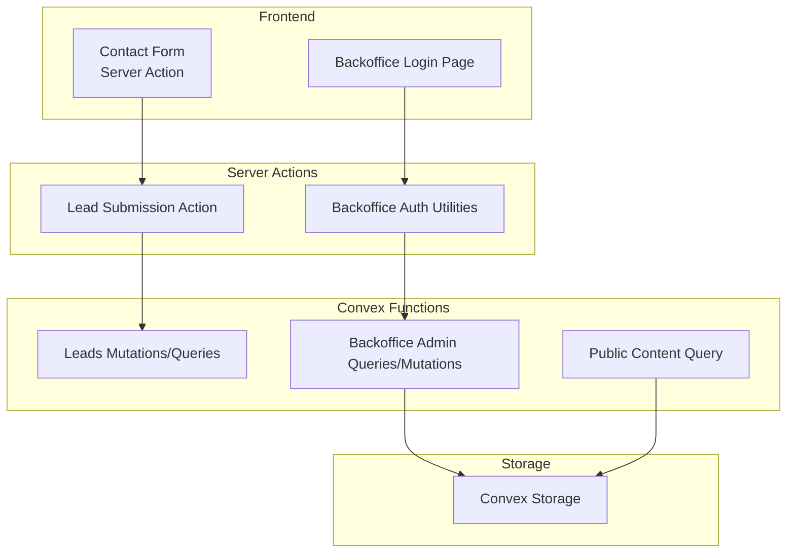
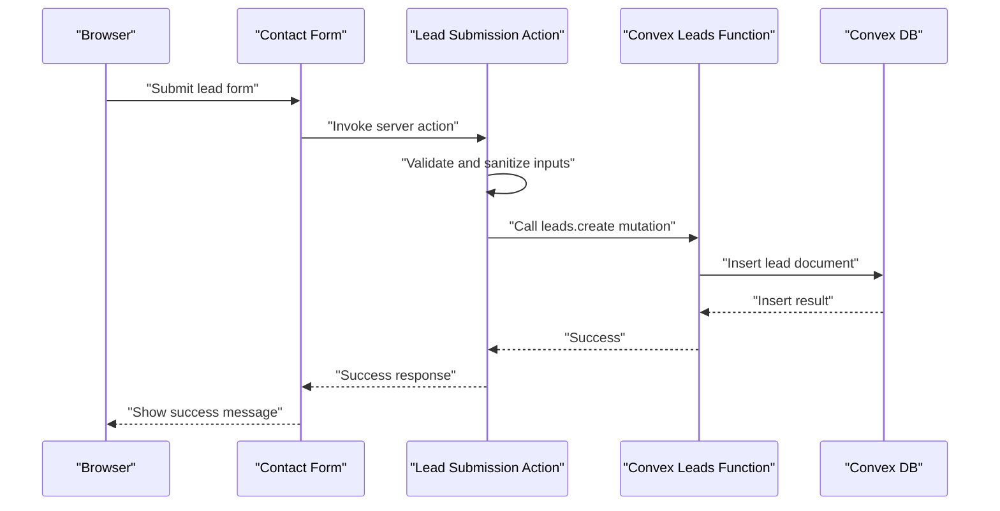
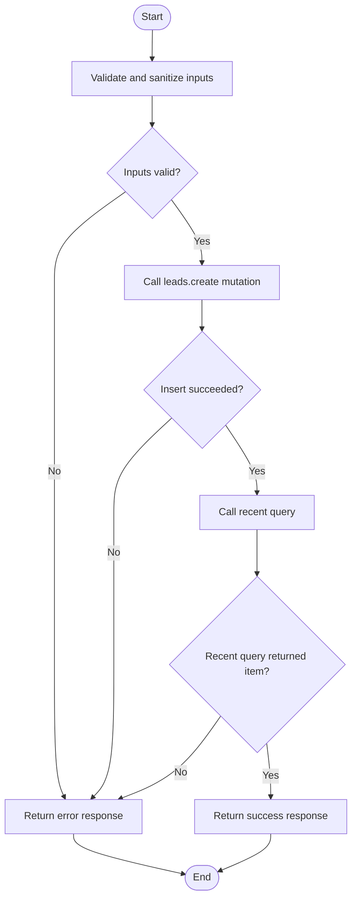
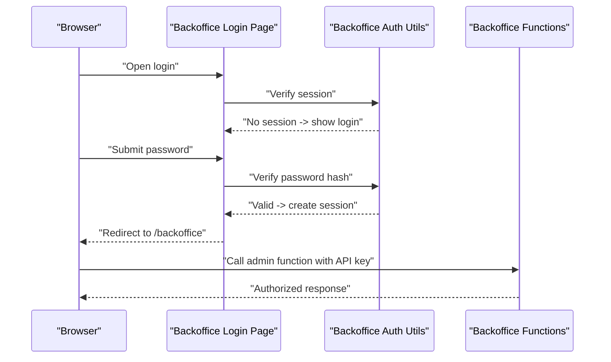
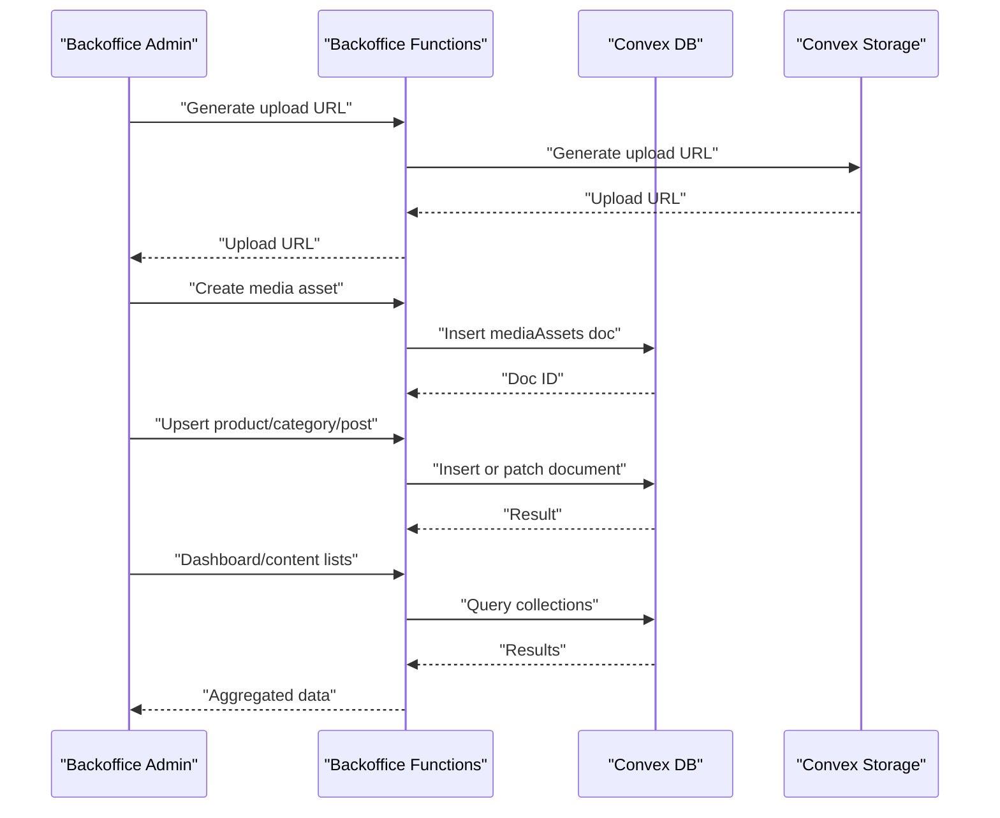
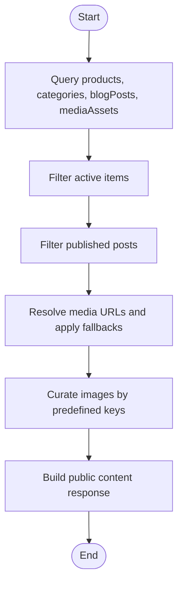
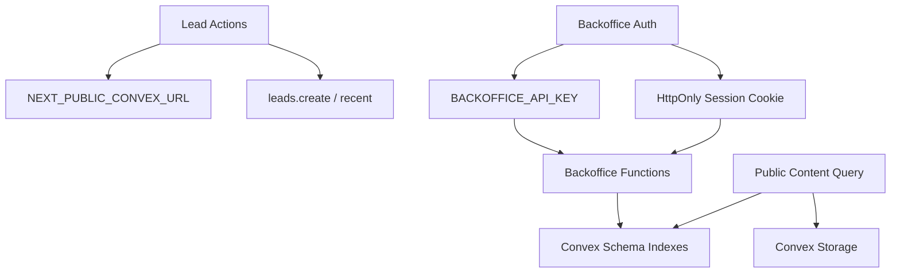

# Integration Testing

<cite>
**Referenced Files in This Document**
- [schema.ts](file://convex/schema.ts)
- [leads.ts](file://convex/leads.ts)
- [backoffice.ts](file://convex/backoffice.ts)
- [lead-actions.ts](file://app/actions/lead-actions.ts)
- [backoffice-auth.ts](file://lib/backoffice-auth.ts)
- [page.tsx](file://app/backoffice/login/page.tsx)
- [CONVEX.md](file://docs/CONVEX.md)
- [SECURITY.md](file://docs/SECURITY.md)
- [package.json](file://package.json)
- [tsconfig.json](file://convex/tsconfig.json)
</cite>

## Table of Contents
1. [Introduction](#introduction)
2. [Project Structure](#project-structure)
3. [Core Components](#core-components)
4. [Architecture Overview](#architecture-overview)
5. [Detailed Component Analysis](#detailed-component-analysis)
6. [Dependency Analysis](#dependency-analysis)
7. [Performance Considerations](#performance-considerations)
8. [Troubleshooting Guide](#troubleshooting-guide)
9. [Conclusion](#conclusion)
10. [Appendices](#appendices)

## Introduction
This document provides comprehensive integration testing guidance for the ADIKI ALVANIR Angola website. It focuses on validating end-to-end flows across Convex database operations, authentication systems, and server action validations. The testing strategy covers:
- API endpoint validation for lead submissions and backoffice operations
- Database interactions and query correctness
- Authentication and session management
- Real-time synchronization expectations and consistency checks
- Content management workflows and media asset handling
- Transaction-like behavior, error propagation, and rollback scenarios
- Test environment setup, data management, and cleanup
- Best practices for concurrency, race conditions, and data integrity
- Debugging failed integration tests and performance tuning

## Project Structure
The integration surface spans three primary areas:
- Frontend server actions and UI forms that trigger backend operations
- Convex server functions (mutations and queries) that persist and retrieve data
- Authentication utilities that protect admin endpoints and manage sessions

**Diagram sources**
- [lead-actions.ts:1-96](file://app/actions/lead-actions.ts#L1-L96)
- [backoffice-auth.ts:1-129](file://lib/backoffice-auth.ts#L1-L129)
- [leads.ts:1-32](file://convex/leads.ts#L1-L32)
- [backoffice.ts:1-385](file://convex/backoffice.ts#L1-L385)

**Section sources**
- [CONVEX.md:1-59](file://docs/CONVEX.md#L1-L59)
- [package.json:1-51](file://package.json#L1-L51)

## Core Components
- Convex schema defines the domain model for leads, media assets, products, categories, blog posts, and site settings. Indexes are defined to support efficient queries.
- Lead submission is handled via a server action that validates input, applies sanitization, and invokes a Convex mutation to insert a lead record.
- Backoffice operations are protected by both an HttpOnly session cookie and a Convex API key. Admin mutations include media upload URL generation, asset creation, archival, content upserts, and dashboard statistics.
- Public content retrieval aggregates active media assets, published blog posts, and curated content for the frontend.

Key integration touchpoints:
- Lead creation mutation and recent query
- Backoffice admin mutations and queries
- Public content aggregation
- Authentication and session lifecycle

**Section sources**
- [schema.ts:1-87](file://convex/schema.ts#L1-L87)
- [leads.ts:1-32](file://convex/leads.ts#L1-L32)
- [backoffice.ts:1-385](file://convex/backoffice.ts#L1-L385)
- [lead-actions.ts:1-96](file://app/actions/lead-actions.ts#L1-L96)
- [backoffice-auth.ts:1-129](file://lib/backoffice-auth.ts#L1-L129)

## Architecture Overview
The integration flow connects client interactions to Convex functions and storage, with authentication gating admin operations.

**Diagram sources**
- [lead-actions.ts:32-96](file://app/actions/lead-actions.ts#L32-L96)
- [leads.ts:7-24](file://convex/leads.ts#L7-L24)

## Detailed Component Analysis

### Lead Submission Workflow
Testing strategy:
- Validate input normalization and sanitization rules
- Verify successful insertion into the leads collection with correct defaults and timestamps
- Confirm recent query returns the inserted lead ordered by creation time
- Simulate failure scenarios (missing environment variable, network errors) and assert error messages

Recommended test scenarios:
- Happy path: valid form inputs, success response, and presence in recent leads
- Edge cases: minimum required fields, email validation, message length limits
- Anti-spam: honeypot field triggers success without storing data
- Failure path: missing Convex URL, mutation error propagation

**Diagram sources**
- [lead-actions.ts:32-96](file://app/actions/lead-actions.ts#L32-L96)
- [leads.ts:7-31](file://convex/leads.ts#L7-L31)

**Section sources**
- [lead-actions.ts:1-96](file://app/actions/lead-actions.ts#L1-L96)
- [leads.ts:1-32](file://convex/leads.ts#L1-L32)

### Backoffice Authentication and Authorization
Testing strategy:
- Verify session creation, signing, and expiration handling
- Validate session verification and redirection for unauthenticated users
- Ensure API key validation for protected Convex functions
- Test session cookie attributes (HttpOnly, SameSite, Secure) and expiry

Recommended test scenarios:
- Successful login flow: correct password hash, session cookie set, redirect to admin
- Expired session: cookie rejected, redirect to login
- Missing secrets: error thrown during hashing/signing/validation
- Unauthorized Convex calls: missing or wrong API key results in unauthorized error

**Diagram sources**
- [page.tsx:17-69](file://app/backoffice/login/page.tsx#L17-L69)
- [backoffice-auth.ts:41-129](file://lib/backoffice-auth.ts#L41-L129)
- [backoffice.ts:25-31](file://convex/backoffice.ts#L25-L31)

**Section sources**
- [backoffice-auth.ts:1-129](file://lib/backoffice-auth.ts#L1-L129)
- [page.tsx:1-69](file://app/backoffice/login/page.tsx#L1-L69)
- [backoffice.ts:25-31](file://convex/backoffice.ts#L25-L31)

### Content Management Workflows (Products, Categories, Blog Posts)
Testing strategy:
- Upsert operations for products, categories, and blog posts
- Archive media assets and verify visibility changes
- Dashboard and content lists aggregation
- Public content retrieval with image URL resolution and fallbacks

Recommended test scenarios:
- Upsert with ID updates vs inserts, timestamps
- Published/unpublished blog posts visibility
- Media asset archival and inactive status filtering
- Public content image resolution via storage URLs

**Diagram sources**
- [backoffice.ts:68-108](file://convex/backoffice.ts#L68-L108)
- [backoffice.ts:186-221](file://convex/backoffice.ts#L186-L221)
- [backoffice.ts:223-258](file://convex/backoffice.ts#L223-L258)
- [backoffice.ts:260-299](file://convex/backoffice.ts#L260-L299)
- [backoffice.ts:120-145](file://convex/backoffice.ts#L120-L145)
- [backoffice.ts:163-184](file://convex/backoffice.ts#L163-L184)

**Section sources**
- [backoffice.ts:1-385](file://convex/backoffice.ts#L1-L385)

### Public Content Retrieval
Testing strategy:
- Validate active filters for products/categories and published filter for blog posts
- Confirm media URL resolution and fallback image handling
- Verify curated image selection logic for hero and category-specific images

Recommended test scenarios:
- Active products/categories present, inactive assets filtered out
- Published posts included, unpublished excluded
- Media URL generation and fallback resolution
- Curated image lookup by normalized filenames

**Diagram sources**
- [backoffice.ts:319-384](file://convex/backoffice.ts#L319-L384)

**Section sources**
- [backoffice.ts:319-384](file://convex/backoffice.ts#L319-L384)

## Dependency Analysis
Key dependencies and contracts:
- Frontend server actions depend on Convex URL environment configuration
- Backoffice functions depend on API key and session cookie
- Convex functions depend on schema-defined indexes for query performance
- Public content depends on media asset status and storage URL availability

**Diagram sources**
- [lead-actions.ts:44-49](file://app/actions/lead-actions.ts#L44-L49)
- [backoffice-auth.ts:120-129](file://lib/backoffice-auth.ts#L120-L129)
- [backoffice.ts:25-31](file://convex/backoffice.ts#L25-L31)
- [schema.ts:1-87](file://convex/schema.ts#L1-L87)

**Section sources**
- [CONVEX.md:16-32](file://docs/CONVEX.md#L16-L32)
- [SECURITY.md:50-59](file://docs/SECURITY.md#L50-L59)

## Performance Considerations
- Batch queries and parallelism: Use Promise.all for dashboard and content list aggregations to minimize latency.
- Index usage: Leverage defined indexes for sorting and filtering to avoid full scans.
- Pagination limits: Respect MAX_ITEMS and MAX_LEADS_RETURNED caps to bound query cost.
- Storage URL caching: Reuse resolved URLs where appropriate to reduce repeated storage calls.
- Concurrency: Limit simultaneous uploads and mutations to prevent contention; stagger batch operations.

[No sources needed since this section provides general guidance]

## Troubleshooting Guide
Common integration test failures and resolutions:
- Missing environment variables:
  - Symptom: Lead action returns configuration error; backoffice functions throw unauthorized errors.
  - Resolution: Set NEXT_PUBLIC_CONVEX_URL, BACKOFFICE_API_KEY, BACKOFFICE_SESSION_SECRET, BACKOFFICE_PASSWORD_HASH.
- Session validation failures:
  - Symptom: Session cookie rejected or expired; redirect to login.
  - Resolution: Ensure session secret matches, cookie attributes align with environment, and expiry is valid.
- Mutation errors:
  - Symptom: Network or validation errors during lead creation or admin upserts.
  - Resolution: Validate input normalization, check storage connectivity, and confirm API key presence.
- Query inconsistencies:
  - Symptom: Missing recent leads or incorrect ordering.
  - Resolution: Verify by_created_at index usage and sort direction; ensure insertion timestamps are current.

**Section sources**
- [lead-actions.ts:44-49](file://app/actions/lead-actions.ts#L44-L49)
- [backoffice-auth.ts:19-26](file://lib/backoffice-auth.ts#L19-L26)
- [backoffice.ts:25-31](file://convex/backoffice.ts#L25-L31)

## Conclusion
This integration testing guide outlines a comprehensive approach to validating the ADIKI ALVANIR Angola website’s lead submissions, backoffice operations, and public content retrieval. By focusing on environment configuration, authentication, database interactions, and storage URL resolution, teams can ensure reliable, consistent, and secure operations across all integration surfaces.

[No sources needed since this section summarizes without analyzing specific files]

## Appendices

### Test Environment Setup
- Local and CI environments must mirror production environment variables for Convex and backoffice security.
- Use Convex dev commands to initialize and push functions locally; deploy to production using convex deploy.
- Configure Next.js runtime environment variables for frontend and server actions.

**Section sources**
- [CONVEX.md:34-48](file://docs/CONVEX.md#L34-L48)
- [package.json:5-12](file://package.json#L5-L12)

### Test Data Management and Cleanup
- Seed minimal test data for leads, media assets, and content entries.
- Use deterministic slugs and filenames for reproducible content retrieval tests.
- Clean up test documents after runs; archive media assets instead of deleting to preserve storage metadata.

[No sources needed since this section provides general guidance]

### Mock Strategies
- External services: Mock Convex HTTP client for server actions; stub storage URL generation for media tests.
- Database connections: Use Convex dev deployment for integration tests; avoid live production writes.
- Third-party integrations: For public content, mock storage URLs and curated image lookups to simulate real behavior without external dependencies.

[No sources needed since this section provides general guidance]

### Transaction Handling, Error Propagation, and Rollback
- Convex mutations are atomic per operation; simulate partial failures by injecting controlled errors and asserting rollback semantics.
- For multi-step operations (upload URL generation followed by asset creation), validate that partial state does not leak.
- Assert error propagation from server actions to UI responses and log captured exceptions.

[No sources needed since this section provides general guidance]

### Concurrent Operations, Race Conditions, and Integrity Validation
- Validate ordering and pagination under concurrent inserts; ensure by_created_at index maintains correct sort order.
- Test concurrent upserts for products/categories/blog posts; confirm last-write-wins semantics or explicit conflict resolution.
- Use deterministic timestamps and unique slugs to prevent collisions.

[No sources needed since this section provides general guidance]

### Debugging Integration Test Failures and Performance Optimization
- Enable verbose logs for Convex function execution and storage operations.
- Profile query performance using Convex metrics and adjust index usage and limits accordingly.
- Use deterministic test seeds and snapshots for repeatable debugging.

[No sources needed since this section provides general guidance]