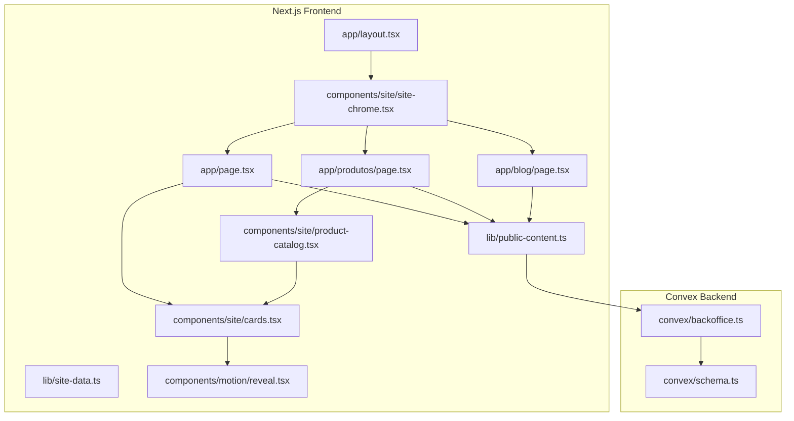
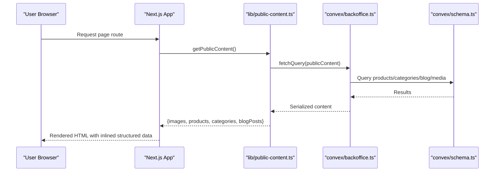
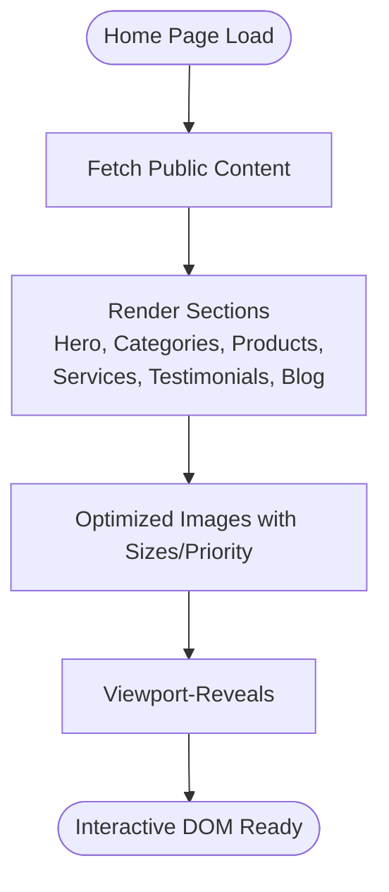
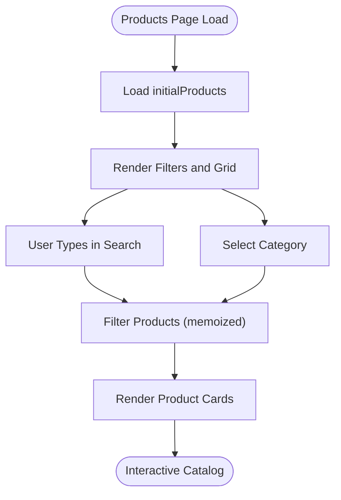
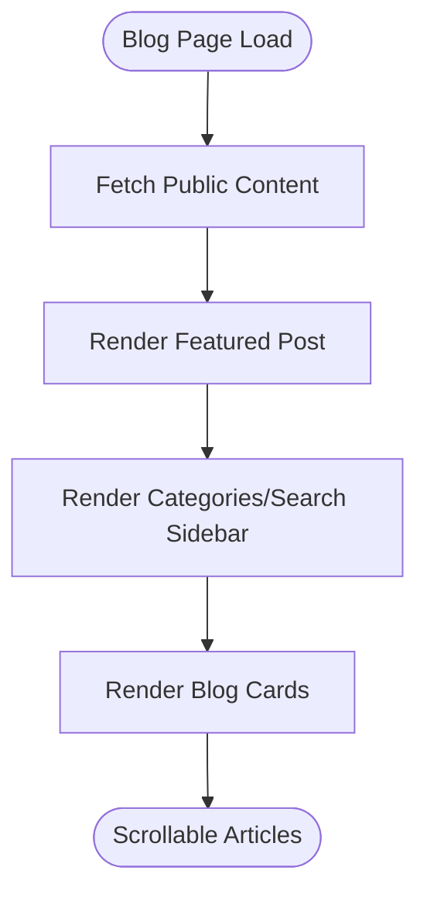
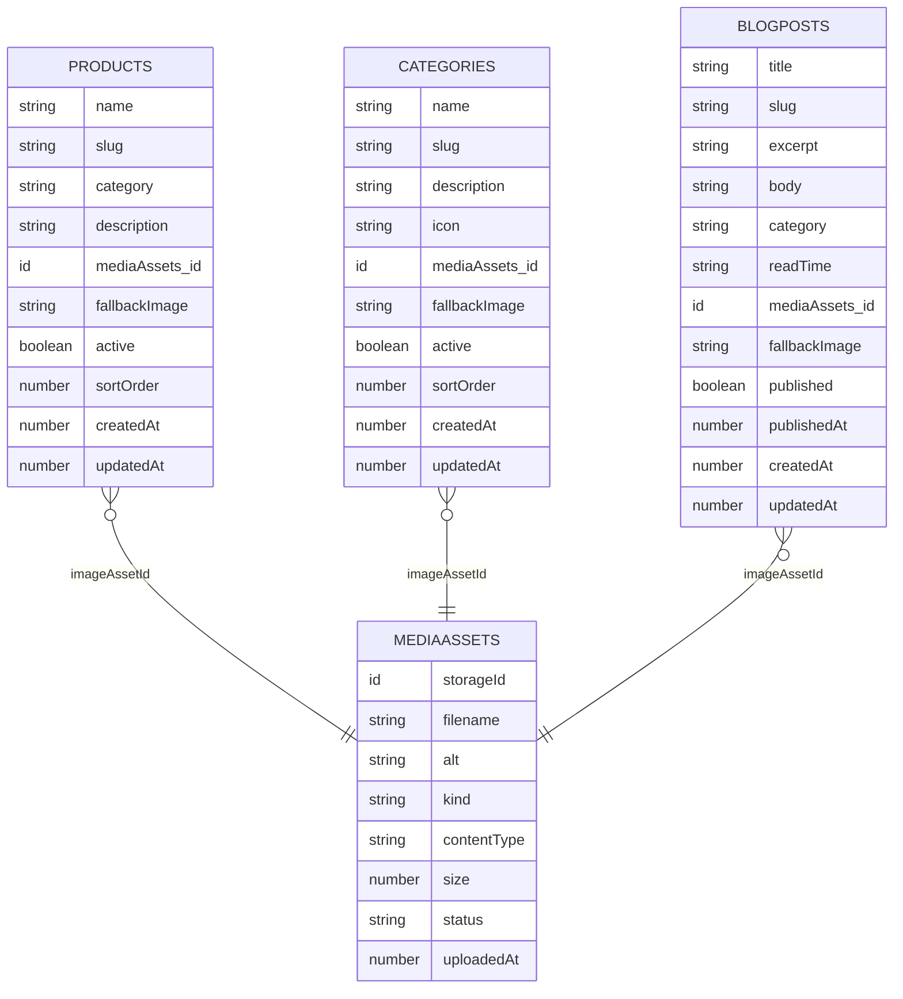
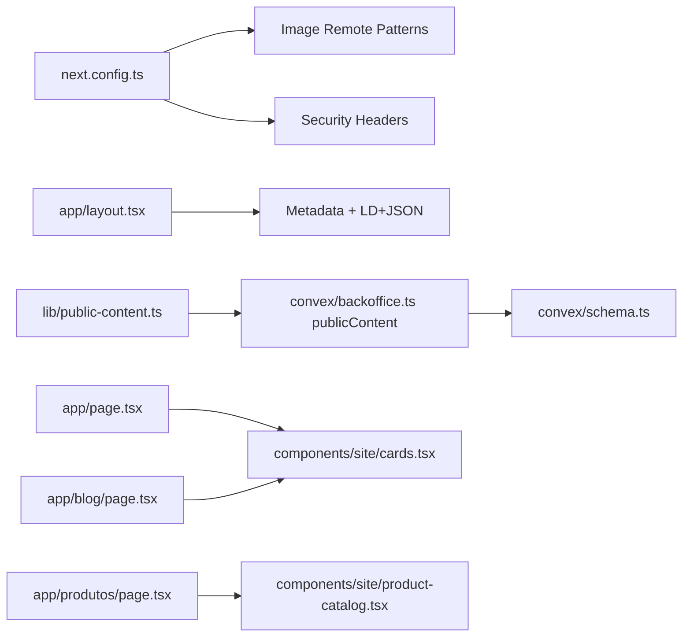

# Performance Testing

<cite>
**Referenced Files in This Document**
- [package.json](file://package.json)
- [next.config.ts](file://next.config.ts)
- [app/layout.tsx](file://app/layout.tsx)
- [app/page.tsx](file://app/page.tsx)
- [app/produtos/page.tsx](file://app/produtos/page.tsx)
- [app/blog/page.tsx](file://app/blog/page.tsx)
- [lib/public-content.ts](file://lib/public-content.ts)
- [lib/site-data.ts](file://lib/site-data.ts)
- [lib/utils.ts](file://lib/utils.ts)
- [components/site/site-chrome.tsx](file://components/site/site-chrome.tsx)
- [components/site/cards.tsx](file://components/site/cards.tsx)
- [components/site/product-catalog.tsx](file://components/site/product-catalog.tsx)
- [components/motion/reveal.tsx](file://components/motion/reveal.tsx)
- [convex/schema.ts](file://convex/schema.ts)
- [convex/backoffice.ts](file://convex/backoffice.ts)
</cite>

## Table of Contents
1. [Introduction](#introduction)
2. [Project Structure](#project-structure)
3. [Core Components](#core-components)
4. [Architecture Overview](#architecture-overview)
5. [Detailed Component Analysis](#detailed-component-analysis)
6. [Dependency Analysis](#dependency-analysis)
7. [Performance Considerations](#performance-considerations)
8. [Troubleshooting Guide](#troubleshooting-guide)
9. [Conclusion](#conclusion)
10. [Appendices](#appendices)

## Introduction
This document defines a comprehensive performance testing strategy for the ADIKI ALVANIR Angola website. It covers load testing, stress testing, and scalability validation, with methodologies for measuring page load times, component rendering performance, and database query optimization. It also documents tools and frameworks for performance benchmarking, memory usage analysis, and network performance measurement, along with practical examples for content delivery optimization, image loading strategies, and lazy-loading implementation. Guidance is included for establishing baselines, monitoring, synthetic monitoring, alerting, and interpreting results to drive targeted performance improvements.

## Project Structure
The site is a Next.js application with a static-first, server-rendered approach and a Convex backend for data and media assets. Key performance-relevant areas:
- Next.js runtime configuration and security headers
- Client-side hydration and component rendering
- Async data fetching via Convex queries
- Image optimization and responsive sizing
- Static metadata and structured data injection

**Diagram sources**
- [app/layout.tsx:1-104](file://app/layout.tsx#L1-L104)
- [components/site/site-chrome.tsx:1-27](file://components/site/site-chrome.tsx#L1-L27)
- [app/page.tsx:1-312](file://app/page.tsx#L1-L312)
- [app/produtos/page.tsx:1-43](file://app/produtos/page.tsx#L1-L43)
- [app/blog/page.tsx:1-136](file://app/blog/page.tsx#L1-L136)
- [lib/public-content.ts:1-107](file://lib/public-content.ts#L1-L107)
- [components/site/cards.tsx:1-151](file://components/site/cards.tsx#L1-L151)
- [components/site/product-catalog.tsx:1-79](file://components/site/product-catalog.tsx#L1-L79)
- [components/motion/reveal.tsx:1-39](file://components/motion/reveal.tsx#L1-L39)
- [convex/schema.ts:1-87](file://convex/schema.ts#L1-L87)
- [convex/backoffice.ts:1-385](file://convex/backoffice.ts#L1-L385)

**Section sources**
- [package.json:1-51](file://package.json#L1-L51)
- [next.config.ts:1-91](file://next.config.ts#L1-L91)
- [app/layout.tsx:1-104](file://app/layout.tsx#L1-L104)

## Core Components
- Next.js configuration and security headers: CSP, HSTS, and image remote patterns influence network and resource policies.
- Layout and shell: Root layout injects structured data and wraps pages with navigation and footer.
- Pages:
  - Home page: Aggregates hero imagery, categories, products, services, testimonials, and blog previews.
  - Products page: Renders a catalog with client-side filtering and category facets.
  - Blog page: Renders a featured article and a list of posts with category and search facets.
- Data fetching:
  - Public content aggregation via Convex query with fallback to static defaults.
  - Revalidation configured per page to balance freshness and cache efficiency.
- Components:
  - Cards and catalogs: Responsive images, client-side filtering, and motion reveals.
  - Motion reveals: Viewport-triggered animations to defer heavy work until in-view.

**Section sources**
- [next.config.ts:63-91](file://next.config.ts#L63-L91)
- [app/layout.tsx:28-104](file://app/layout.tsx#L28-L104)
- [app/page.tsx:28-312](file://app/page.tsx#L28-L312)
- [app/produtos/page.tsx:15-43](file://app/produtos/page.tsx#L15-L43)
- [app/blog/page.tsx:20-136](file://app/blog/page.tsx#L20-L136)
- [lib/public-content.ts:65-107](file://lib/public-content.ts#L65-L107)
- [components/site/cards.tsx:1-151](file://components/site/cards.tsx#L1-L151)
- [components/site/product-catalog.tsx:1-79](file://components/site/product-catalog.tsx#L1-L79)
- [components/motion/reveal.tsx:1-39](file://components/motion/reveal.tsx#L1-L39)

## Architecture Overview
The performance architecture centers on:
- Static metadata and structured data injected at build/render time.
- Async data retrieval from Convex with controlled revalidation windows.
- Client-side hydration and component rendering with viewport-aware animations.
- Image optimization via Next.js Image with responsive sizes and priority hints.

**Diagram sources**
- [lib/public-content.ts:65-107](file://lib/public-content.ts#L65-L107)
- [convex/backoffice.ts:319-385](file://convex/backoffice.ts#L319-L385)
- [convex/schema.ts:1-87](file://convex/schema.ts#L1-L87)
- [app/layout.tsx:73-102](file://app/layout.tsx#L73-L102)

## Detailed Component Analysis

### Home Page Performance Profile
- Rendering profile: Hero image with priority, category and product grids, services, testimonials, and blog previews.
- Data fetching: Single async call to public content with revalidation window.
- Images: Responsive sizes and priority hints to reduce CLS and improve LCP.
- Motion: Viewport-triggered reveals to defer animation work until visible.

**Diagram sources**
- [app/page.tsx:30-312](file://app/page.tsx#L30-L312)
- [lib/public-content.ts:65-107](file://lib/public-content.ts#L65-L107)
- [components/motion/reveal.tsx:11-24](file://components/motion/reveal.tsx#L11-L24)

**Section sources**
- [app/page.tsx:28-312](file://app/page.tsx#L28-L312)
- [lib/public-content.ts:65-107](file://lib/public-content.ts#L65-L107)

### Products Catalog Performance Profile
- Rendering profile: Client-side filtering and category facets with memoized computations.
- Data fetching: Uses initial products from public content; client filters avoid additional network requests.
- UX: Debounceable search input and category toggles minimize re-renders.

**Diagram sources**
- [app/produtos/page.tsx:17-43](file://app/produtos/page.tsx#L17-L43)
- [components/site/product-catalog.tsx:12-79](file://components/site/product-catalog.tsx#L12-L79)
- [components/site/cards.tsx:57-88](file://components/site/cards.tsx#L57-L88)

**Section sources**
- [app/produtos/page.tsx:15-43](file://app/produtos/page.tsx#L15-L43)
- [components/site/product-catalog.tsx:12-79](file://components/site/product-catalog.tsx#L12-L79)

### Blog Page Performance Profile
- Rendering profile: Featured article with prominent image and sidebar facets.
- Data fetching: Single async call to public content; categories derived client-side.
- UX: Sticky sidebar and anchor navigation for smooth reading.

**Diagram sources**
- [app/blog/page.tsx:22-136](file://app/blog/page.tsx#L22-L136)
- [lib/public-content.ts:65-107](file://lib/public-content.ts#L65-L107)
- [components/site/cards.tsx:120-150](file://components/site/cards.tsx#L120-L150)

**Section sources**
- [app/blog/page.tsx:20-136](file://app/blog/page.tsx#L20-L136)
- [lib/public-content.ts:65-107](file://lib/public-content.ts#L65-L107)

### Data Access and Query Optimization
- Convex schema defines indexes for efficient reads by status, sort order, and publication state.
- Public content query aggregates products, categories, blog posts, and media assets with controlled limits.
- Media URLs are resolved via storage URLs, enabling CDN-friendly delivery.

**Diagram sources**
- [convex/schema.ts:37-85](file://convex/schema.ts#L37-L85)
- [convex/backoffice.ts:33-52](file://convex/backoffice.ts#L33-L52)

**Section sources**
- [convex/schema.ts:1-87](file://convex/schema.ts#L1-L87)
- [convex/backoffice.ts:319-385](file://convex/backoffice.ts#L319-L385)

## Dependency Analysis
- Next.js runtime and configuration:
  - Security headers and CSP impact network performance and resource loading.
  - Image remote patterns enable serving media from Convex domains.
- Data layer:
  - Public content depends on Convex queries; failures fall back to static defaults.
  - Indexes in schema support fast reads for active and published content.
- Components:
  - Cards and catalogs rely on responsive images and memoized filtering.
  - Motion reveals depend on viewport intersection to defer expensive animations.

**Diagram sources**
- [next.config.ts:63-91](file://next.config.ts#L63-L91)
- [app/layout.tsx:28-104](file://app/layout.tsx#L28-L104)
- [lib/public-content.ts:65-107](file://lib/public-content.ts#L65-L107)
- [convex/backoffice.ts:319-385](file://convex/backoffice.ts#L319-L385)
- [convex/schema.ts:1-87](file://convex/schema.ts#L1-L87)
- [components/site/cards.tsx:1-151](file://components/site/cards.tsx#L1-L151)
- [components/site/product-catalog.tsx:1-79](file://components/site/product-catalog.tsx#L1-L79)

**Section sources**
- [next.config.ts:63-91](file://next.config.ts#L63-L91)
- [lib/public-content.ts:65-107](file://lib/public-content.ts#L65-L107)
- [convex/schema.ts:1-87](file://convex/schema.ts#L1-L87)

## Performance Considerations

### Performance Testing Methodology
- Load testing
  - Define steady-state traffic profiles: homepage visits, product browsing, blog reading.
  - Use synthetic monitors to simulate concurrent users across routes.
  - Measure RPS, latency percentiles, and error rates.
- Stress testing
  - Gradually increase concurrency to identify saturation points in Next.js rendering and Convex queries.
  - Observe CPU/memory usage and GC pauses during peak loads.
- Scalability validation
  - Validate horizontal scaling of Next.js workers and Convex compute.
  - Confirm CDN effectiveness for images and static assets.

### Measuring Page Load Times
- Metrics to collect
  - Time to First Byte (TTFB), Largest Contentful Paint (LCP), First Input Delay (FID), Cumulative Layout Shift (CLS).
- Collection approach
  - Use browser performance APIs and synthetic monitoring agents.
  - Track metrics per route and per device class.

### Component Rendering Performance
- Identify hot paths: product catalog filtering, blog post rendering, hero image loading.
- Use React DevTools Profiler to detect excessive re-renders and long tasks.
- Apply memoization and virtualization for large lists.

### Database Query Optimization
- Index usage: leverage existing indexes for active/published/sort fields.
- Query batching: combine related reads into single calls where feasible.
- Limit results: enforce caps on returned items to bound response size.

### Tools and Frameworks
- Synthetic monitoring: configure synthetic checks for key routes.
- Browser performance: Lighthouse, WebPageTest, and browser devtools.
- Backend profiling: Convex observability and Next.js telemetry.
- Memory analysis: Chrome DevTools Memory panel and heap snapshots.
- Network measurement: DevTools Network panel and HAR analysis.

### Content Delivery Optimization
- Image loading strategies
  - Use Next.js Image with appropriate widths, aspect ratios, and priority for above-the-fold content.
  - Prefer modern formats (AVIF/WebP) and responsive sizes to reduce transfer size.
- Lazy loading
  - Defer offscreen images and animations using viewport triggers.
- Caching
  - Configure revalidation windows per page to balance freshness and cache hit rate.
  - Use CDN for media assets served via Convex storage URLs.

### Concurrent User Scenarios
- Homepage spikes: validate hero image delivery and component hydration under load.
- Product catalog searches: measure filter responsiveness and render throughput.
- Blog browsing: track category and search facet performance.

### Database Connection Pooling and Caching
- Connection pooling: ensure Convex connections scale with request bursts.
- Application caching: cache public content with revalidation to reduce query frequency.

### Environment Setup and Monitoring
- Performance environments: separate staging and production configurations.
- Baseline establishment: capture metrics for a week under normal traffic.
- Alerting: set thresholds for TTFB, LCP, and error rates; notify on regressions.

### Bottleneck Identification and Scalability Planning
- Use flame graphs and profiling to locate CPU-intensive tasks.
- Scale workers and CDN capacity based on observed bottlenecks.
- Plan for regional latency improvements and edge caching.

### Interpreting Results and Improvements
- Compare metrics against baselines; prioritize regressions affecting core conversion funnels.
- Implement incremental changes and re-measure to quantify impact.
- Iterate on image optimization, component lazy-loading, and query efficiency.

## Troubleshooting Guide
- Convex connectivity issues
  - Symptom: Fallback to static content on data fetch errors.
  - Action: Verify environment variables and retry logic; monitor Convex health.
- Image delivery problems
  - Symptom: Missing or low-quality images on mobile networks.
  - Action: Audit image formats, sizes, and remote patterns; confirm CDN propagation.
- Rendering jank
  - Symptom: Slow filtering or layout shifts.
  - Action: Inspect long tasks, apply memoization, and adjust viewport triggers.

**Section sources**
- [lib/public-content.ts:65-107](file://lib/public-content.ts#L65-L107)
- [next.config.ts:63-91](file://next.config.ts#L63-L91)
- [components/motion/reveal.tsx:11-24](file://components/motion/reveal.tsx#L11-L24)

## Conclusion
A robust performance testing program for the ADIKI ALVANIR Angola website requires coordinated efforts across frontend rendering, data access, and content delivery. By establishing baselines, instrumenting synthetic and browser-based monitoring, and focusing on image optimization, lazy loading, and query efficiency, teams can validate scalability, identify bottlenecks, and continuously improve user experience across devices and regions.

## Appendices

### Appendix A: Key Performance Metrics Definitions
- TTFB: Time from request initiation to first byte received.
- LCP: Time to render the largest contentful element.
- FID: Time from user interaction to first response.
- CLS: Sum total of layout shift scores during page load.
- Revalidation window: Frequency at which cached content is refreshed.

**Section sources**
- [app/page.tsx:28-312](file://app/page.tsx#L28-L312)
- [app/produtos/page.tsx:15-43](file://app/produtos/page.tsx#L15-L43)
- [app/blog/page.tsx:20-136](file://app/blog/page.tsx#L20-L136)

### Appendix B: Recommended Synthetic Checks
- Homepage: Full navigation and hero image load.
- Products: Initial render, category selection, and search input.
- Blog: Featured article and list rendering, category facet click.

[No sources needed since this section provides general guidance]