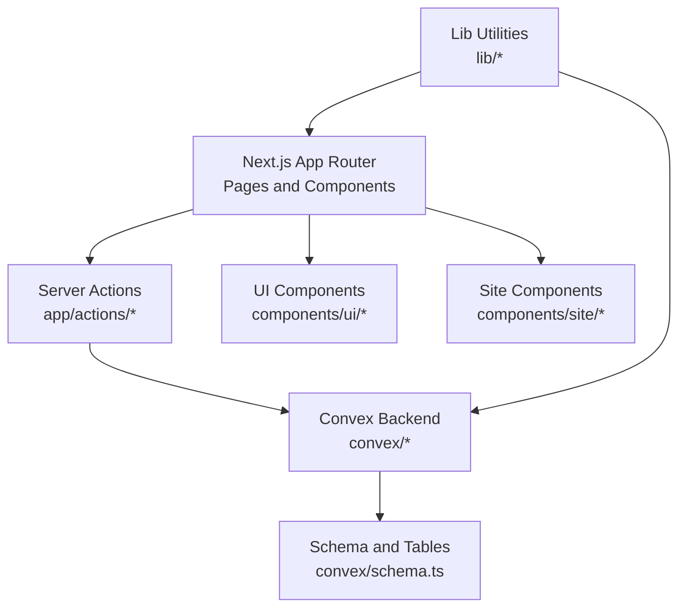
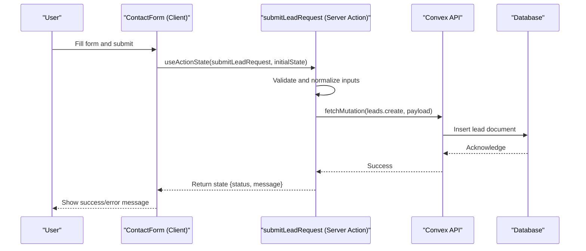
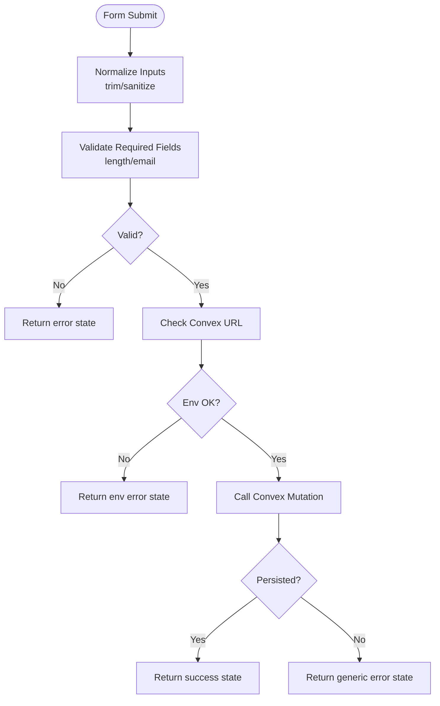
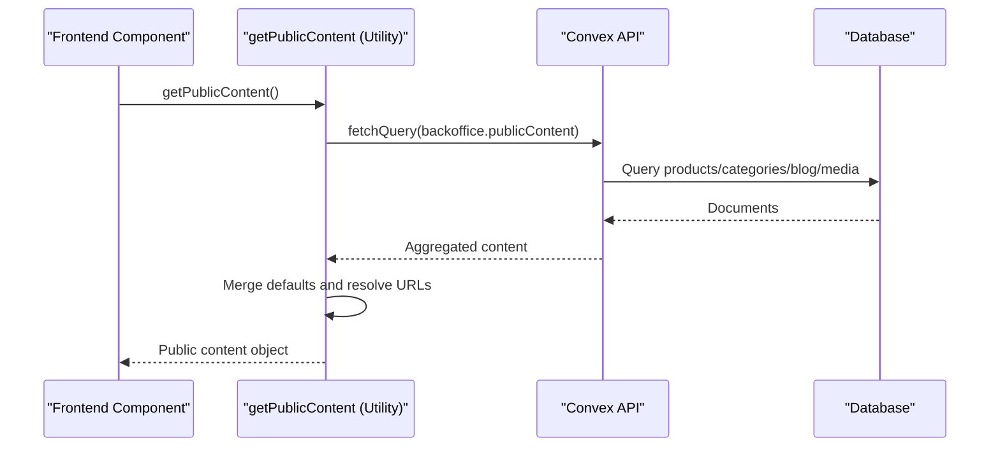
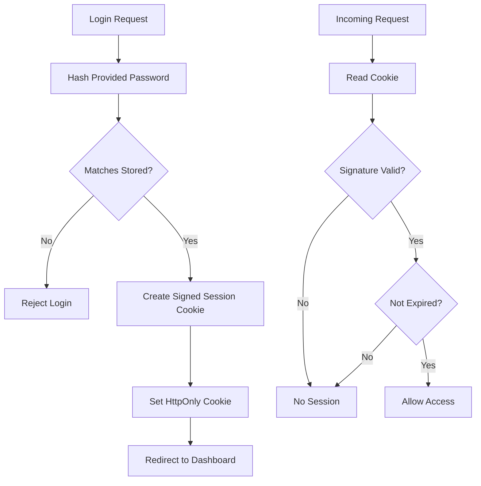
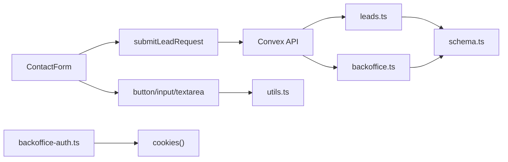

# Testing Strategy

<cite>
**Referenced Files in This Document**
- [package.json](file://package.json)
- [lead-actions.ts](file://app/actions/lead-actions.ts)
- [contact-form.tsx](file://components/site/contact-form.tsx)
- [utils.ts](file://lib/utils.ts)
- [public-content.ts](file://lib/public-content.ts)
- [site-data.ts](file://lib/site-data.ts)
- [leads.ts](file://convex/leads.ts)
- [backoffice.ts](file://convex/backoffice.ts)
- [schema.ts](file://convex/schema.ts)
- [button.tsx](file://components/ui/button.tsx)
- [input.tsx](file://components/ui/input.tsx)
- [textarea.tsx](file://components/ui/textarea.tsx)
- [backoffice-auth.ts](file://lib/backoffice-auth.ts)
</cite>

## Table of Contents
1. [Introduction](#introduction)
2. [Project Structure](#project-structure)
3. [Core Components](#core-components)
4. [Architecture Overview](#architecture-overview)
5. [Detailed Component Analysis](#detailed-component-analysis)
6. [Dependency Analysis](#dependency-analysis)
7. [Performance Considerations](#performance-considerations)
8. [Accessibility Testing Procedures](#accessibility-testing-procedures)
9. [Cross-Browser Compatibility Testing](#cross-browser-compatibility-testing)
10. [Continuous Integration Pipeline](#continuous-integration-pipeline)
11. [Testing Documentation Standards](#testing-documentation-standards)
12. [Troubleshooting Guide](#troubleshooting-guide)
13. [Conclusion](#conclusion)

## Introduction
This document defines a comprehensive testing strategy for the ADIKI ALVANIR Angola website. It covers unit testing for React components (including hooks and utilities), integration testing for Convex APIs and database interactions, end-to-end testing for critical user workflows (lead submission and content management), and operational testing practices (performance, accessibility, cross-browser compatibility, CI/CD, and documentation). The strategy emphasizes realistic mocks, deterministic assertions, and maintainable test suites aligned with the project’s Next.js App Router, Convex backend, and Tailwind-based UI components.

## Project Structure
The project follows a modern Next.js App Router structure with a clear separation of concerns:
- Frontend pages and UI components under app and components directories
- Convex backend definitions under convex directory
- Shared utilities and data under lib directory
- Build and lint scripts under package.json



**Diagram sources**
- [package.json:1-51](file://package.json#L1-L51)
- [lead-actions.ts:1-96](file://app/actions/lead-actions.ts#L1-L96)
- [contact-form.tsx:1-92](file://components/site/contact-form.tsx#L1-L92)
- [schema.ts:1-87](file://convex/schema.ts#L1-L87)

**Section sources**
- [package.json:1-51](file://package.json#L1-L51)

## Core Components
This section identifies the primary targets for testing and their roles in the system.

- Lead submission flow
  - UI form component: collects user input and triggers server action
  - Server action: validates input, applies normalization, and persists via Convex
  - Convex mutation: inserts lead record into the database
- Public content retrieval
  - Utility function: queries Convex for public content and merges defaults
  - Convex query: aggregates products, categories, blog posts, and media assets
- Back-office authentication
  - Authentication utilities: session creation, verification, and protection middleware
- UI primitives
  - Button, Input, Textarea components: styled primitives used across the site

**Section sources**
- [contact-form.tsx:17-91](file://components/site/contact-form.tsx#L17-L91)
- [lead-actions.ts:32-95](file://app/actions/lead-actions.ts#L32-L95)
- [leads.ts:7-31](file://convex/leads.ts#L7-L31)
- [public-content.ts:65-106](file://lib/public-content.ts#L65-L106)
- [backoffice-auth.ts:60-118](file://lib/backoffice-auth.ts#L60-L118)
- [button.tsx:1-53](file://components/ui/button.tsx#L1-L53)
- [input.tsx:1-24](file://components/ui/input.tsx#L1-L24)
- [textarea.tsx:1-23](file://components/ui/textarea.tsx#L1-L23)

## Architecture Overview
The testing strategy aligns with the following runtime flow for lead submission and content retrieval.



**Diagram sources**
- [contact-form.tsx:17-91](file://components/site/contact-form.tsx#L17-L91)
- [lead-actions.ts:32-95](file://app/actions/lead-actions.ts#L32-L95)
- [leads.ts:7-31](file://convex/leads.ts#L7-L31)

## Detailed Component Analysis

### Lead Submission Workflow
Focus areas for unit and integration testing:
- Form component behavior (React Testing Library)
- Server action logic (validation, normalization, error handling)
- Convex mutation (schema compliance, indexing, persistence)
- Edge cases (honeypot trap, environment misconfiguration)



**Diagram sources**
- [lead-actions.ts:32-95](file://app/actions/lead-actions.ts#L32-L95)
- [leads.ts:7-31](file://convex/leads.ts#L7-L31)

**Section sources**
- [contact-form.tsx:17-91](file://components/site/contact-form.tsx#L17-L91)
- [lead-actions.ts:32-95](file://app/actions/lead-actions.ts#L32-L95)
- [leads.ts:7-31](file://convex/leads.ts#L7-L31)

### Public Content Retrieval
Focus areas:
- Utility function behavior (fetchQuery, merging defaults, error fallback)
- Convex query composition and index usage
- Media URL resolution and fallback logic



**Diagram sources**
- [public-content.ts:65-106](file://lib/public-content.ts#L65-L106)
- [backoffice.ts:319-384](file://convex/backoffice.ts#L319-L384)

**Section sources**
- [public-content.ts:65-106](file://lib/public-content.ts#L65-L106)
- [backoffice.ts:319-384](file://convex/backoffice.ts#L319-L384)

### Back-Office Authentication
Focus areas:
- Password hashing and verification
- Session creation, signing, and expiration
- Session validation and middleware redirection



**Diagram sources**
- [backoffice-auth.ts:41-118](file://lib/backoffice-auth.ts#L41-L118)

**Section sources**
- [backoffice-auth.ts:41-118](file://lib/backoffice-auth.ts#L41-L118)

### UI Primitives
Focus areas:
- Variants and sizes rendering
- Accessibility attributes and focus styles
- Composition via Radix Slot

```mermaid
classDiagram
class Button {
+variant : "default"|"green"|"outline"|"ghost"|"inverse"
+size : "default"|"sm"|"lg"|"icon"
+asChild : boolean
}
class Input {
+type : string
}
class Textarea {
+rows : number
}
Button --> Utils["cn()"]
Input --> Utils["cn()"]
Textarea --> Utils["cn()"]
```

**Diagram sources**
- [button.tsx:42-52](file://components/ui/button.tsx#L42-L52)
- [input.tsx:7-19](file://components/ui/input.tsx#L7-L19)
- [textarea.tsx:7-17](file://components/ui/textarea.tsx#L7-L17)
- [utils.ts:4-6](file://lib/utils.ts#L4-L6)

**Section sources**
- [button.tsx:1-53](file://components/ui/button.tsx#L1-L53)
- [input.tsx:1-24](file://components/ui/input.tsx#L1-L24)
- [textarea.tsx:1-23](file://components/ui/textarea.tsx#L1-L23)
- [utils.ts:1-7](file://lib/utils.ts#L1-L7)

## Dependency Analysis
Testing dependencies and coupling:
- Components depend on shared utilities (cn) and UI primitives
- Server actions depend on Convex APIs and environment variables
- Convex mutations rely on schema-defined tables and indexes
- Back-office utilities depend on environment secrets and cookies



**Diagram sources**
- [contact-form.tsx:17-91](file://components/site/contact-form.tsx#L17-L91)
- [lead-actions.ts:32-95](file://app/actions/lead-actions.ts#L32-L95)
- [leads.ts:7-31](file://convex/leads.ts#L7-L31)
- [backoffice.ts:319-384](file://convex/backoffice.ts#L319-L384)
- [schema.ts:1-87](file://convex/schema.ts#L1-L87)
- [button.tsx:1-53](file://components/ui/button.tsx#L1-L53)
- [input.tsx:1-24](file://components/ui/input.tsx#L1-L24)
- [textarea.tsx:1-23](file://components/ui/textarea.tsx#L1-L23)
- [utils.ts:1-7](file://lib/utils.ts#L1-L7)
- [backoffice-auth.ts:60-118](file://lib/backoffice-auth.ts#L60-L118)

**Section sources**
- [schema.ts:1-87](file://convex/schema.ts#L1-L87)

## Performance Considerations
Approaches for load and stress testing:
- End-to-end load tests simulating concurrent lead submissions
- Database index validation for “by_created_at” and “by_status_and_uploaded_at”
- API response latency monitoring for Convex queries and mutations
- Static asset caching and CDN readiness checks
- Synthetic transactions for content-heavy pages (products, blog)

[No sources needed since this section provides general guidance]

## Accessibility Testing Procedures
Recommended practices:
- Keyboard navigation and focus order validation for forms and buttons
- ARIA live regions for status messages (aria-live)
- Contrast and color usage for success/error states
- Semantic HTML and label associations
- Screen reader testing for dynamic content updates

[No sources needed since this section provides general guidance]

## Cross-Browser Compatibility Testing
Recommended practices:
- Test on latest Chrome, Firefox, Safari, and mobile browsers
- Validate form behavior, animations, and layout across viewport sizes
- Confirm cookie handling for authentication flows
- Regression testing after UI primitive updates

[No sources needed since this section provides general guidance]

## Continuous Integration Pipeline
Proposed CI stages:
- Lint and type check
- Unit tests (mocked Convex and environment)
- Integration tests against a test Convex deployment
- End-to-end tests for critical flows (lead submission, back-office login)
- Accessibility scans and cross-browser matrix jobs
- Security and secrets scanning

[No sources needed since this section provides general guidance]

## Testing Documentation Standards
Standards for test case management:
- Describe each test by user story or acceptance criteria
- Use clear, descriptive names and comments
- Document assumptions, environment prerequisites, and mocks
- Track flaky tests and mark them accordingly
- Maintain a test health dashboard

[No sources needed since this section provides general guidance]

## Troubleshooting Guide
Common issues and resolutions:
- Convex URL not configured
  - Symptom: Immediate error state returned by server action
  - Resolution: Set NEXT_PUBLIC_CONVEX_URL and redeploy
- Email validation failures
  - Symptom: Validation error for malformed emails
  - Resolution: Ensure proper formatting and length constraints
- Honeypot trap triggered
  - Symptom: Success state despite missing required fields
  - Resolution: Verify hidden field is not filled by bots
- Authentication errors
  - Symptom: Session rejected or redirect to login
  - Resolution: Check BACKOFFICE_SESSION_SECRET and BACKOFFICE_API_KEY

**Section sources**
- [lead-actions.ts:44-49](file://app/actions/lead-actions.ts#L44-L49)
- [lead-actions.ts:65-70](file://app/actions/lead-actions.ts#L65-L70)
- [lead-actions.ts:37-42](file://app/actions/lead-actions.ts#L37-L42)
- [backoffice-auth.ts:21-23](file://lib/backoffice-auth.ts#L21-L23)
- [backoffice-auth.ts:120-128](file://lib/backoffice-auth.ts#L120-L128)

## Conclusion
This testing strategy provides a structured approach to validating the ADIKI ALVANIR Angola website across UI, server actions, Convex integrations, and operational concerns. By focusing on realistic mocks, deterministic assertions, and comprehensive coverage of critical workflows, teams can ensure reliability, performance, and maintainability as the platform evolves.