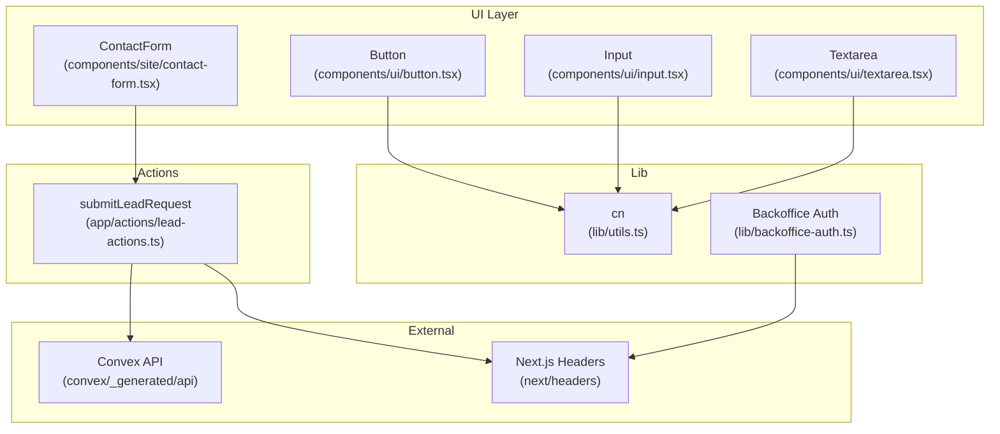
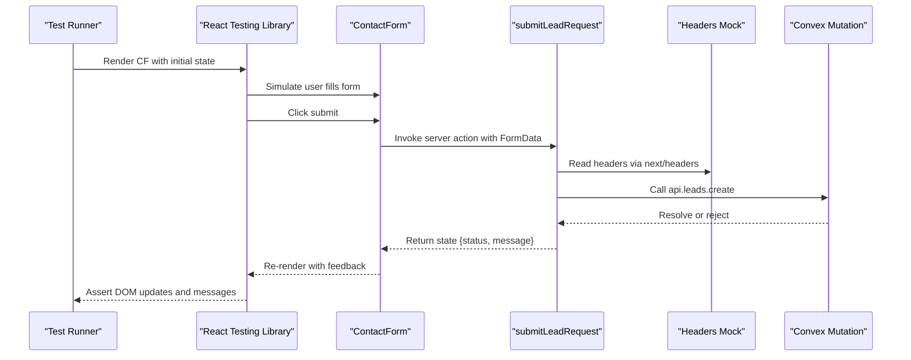
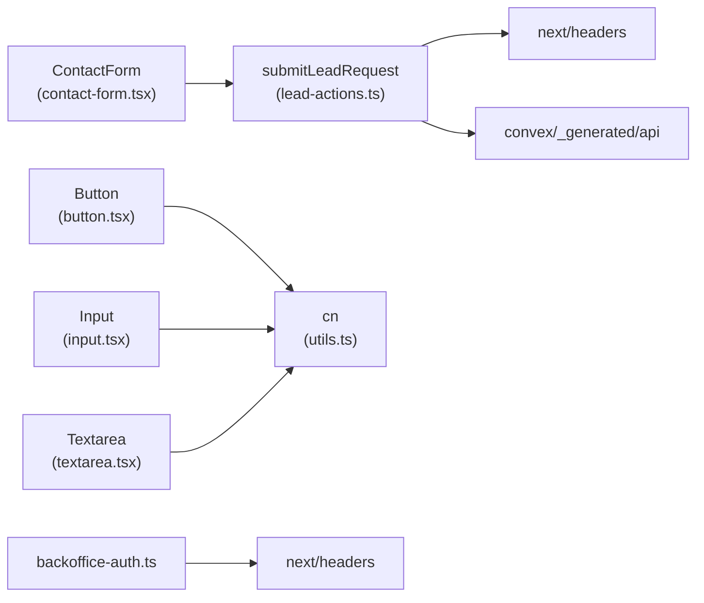

# Unit Testing

<cite>
**Referenced Files in This Document**
- [package.json](file://package.json)
- [tsconfig.json](file://tsconfig.json)
- [lead-actions.ts](file://app/actions/lead-actions.ts)
- [contact-form.tsx](file://components/site/contact-form.tsx)
- [button.tsx](file://components/ui/button.tsx)
- [input.tsx](file://components/ui/input.tsx)
- [textarea.tsx](file://components/ui/textarea.tsx)
- [utils.ts](file://lib/utils.ts)
- [backoffice-auth.ts](file://lib/backoffice-auth.ts)
</cite>

## Table of Contents
1. [Introduction](#introduction)
2. [Project Structure](#project-structure)
3. [Core Components](#core-components)
4. [Architecture Overview](#architecture-overview)
5. [Detailed Component Analysis](#detailed-component-analysis)
6. [Dependency Analysis](#dependency-analysis)
7. [Performance Considerations](#performance-considerations)
8. [Troubleshooting Guide](#troubleshooting-guide)
9. [Conclusion](#conclusion)
10. [Appendices](#appendices)

## Introduction
This document provides comprehensive unit testing guidance for the ADIKI ALVANIR Angola website. It focuses on testing React components with React Testing Library, validating server actions and form logic, verifying utility functions, and mocking external dependencies such as Convex and Next.js server APIs. It also outlines testing strategies for asynchronous operations, error handling, and edge cases, along with best practices for TypeScript components, prop validation, and component lifecycle testing.

## Project Structure
The project is a Next.js application with a clear separation of concerns:
- UI components under components/
- Shared utilities under lib/
- Server actions under app/actions/
- Convex schema and generated API under convex/

Key areas for unit testing:
- UI components and form logic
- Server actions and normalization/validation logic
- Utility functions for class merging
- Authentication helpers for backoffice sessions

**Diagram sources**
- [contact-form.tsx:17-91](file://components/site/contact-form.tsx#L17-L91)
- [lead-actions.ts:32-95](file://app/actions/lead-actions.ts#L32-L95)
- [utils.ts:4-6](file://lib/utils.ts#L4-L6)
- [backoffice-auth.ts:3-4](file://lib/backoffice-auth.ts#L3-L4)

**Section sources**
- [package.json:14-36](file://package.json#L14-L36)
- [tsconfig.json:1-29](file://tsconfig.json#L1-L29)

## Core Components
This section highlights the primary targets for unit testing and their responsibilities:
- ContactForm: Renders a lead capture form, integrates with a server action, and displays feedback based on action state.
- submitLeadRequest: Normalizes and validates form inputs, performs anti-bot checks, and invokes a Convex mutation via Next.js fetchMutation.
- UI primitives: Button, Input, Textarea rely on shared utility functions for styling.
- cn: Utility function for merging Tailwind classes.
- Backoffice authentication helpers: Password hashing, session creation/clearance, and session verification.

**Section sources**
- [contact-form.tsx:17-91](file://components/site/contact-form.tsx#L17-L91)
- [lead-actions.ts:32-95](file://app/actions/lead-actions.ts#L32-L95)
- [button.tsx:42-52](file://components/ui/button.tsx#L42-L52)
- [input.tsx:7-23](file://components/ui/input.tsx#L7-L23)
- [textarea.tsx:7-22](file://components/ui/textarea.tsx#L7-L22)
- [utils.ts:4-6](file://lib/utils.ts#L4-L6)
- [backoffice-auth.ts:35-128](file://lib/backoffice-auth.ts#L35-L128)

## Architecture Overview
The testing architecture centers around isolating UI rendering, simulating user interactions, and mocking server-side logic and external dependencies.

**Diagram sources**
- [contact-form.tsx:17-91](file://components/site/contact-form.tsx#L17-L91)
- [lead-actions.ts:32-95](file://app/actions/lead-actions.ts#L32-L95)

## Detailed Component Analysis

### ContactForm Component Tests
Focus areas:
- Rendering inputs and buttons with correct attributes and accessibility labels
- Handling useActionState state transitions (idle → pending → success/error)
- Verifying form reset on successful submission
- Ensuring hidden honeypot field is present and not visible
- Validating aria-live feedback messages and styling classes

Recommended assertions:
- Hidden label/input for the honeypot field exists and is visually hidden
- Grid layout renders required fields with min/max lengths
- Submit button reflects disabled/enabled state based on isPending
- Feedback message appears and applies appropriate styles after action completes
- Form resets after successful submission

Mock strategies:
- Mock useActionState to control returned state and isPending
- Mock next/headers to provide deterministic user-agent
- Mock Convex mutation to simulate success and failure paths

Edge cases:
- Empty or partial form submission triggers validation errors
- Invalid email format produces an error message
- Missing NEXT_PUBLIC_CONVEX_URL returns an environment error state
- Anti-bot detection activates when honeypot is filled

Asynchronous patterns:
- Test submission flow with pending state and final state resolution
- Verify re-render occurs after state change

**Section sources**
- [contact-form.tsx:17-91](file://components/site/contact-form.tsx#L17-L91)
- [lead-actions.ts:32-95](file://app/actions/lead-actions.ts#L32-L95)

### submitLeadRequest Validation and Normalization Tests
Validation and normalization covered:
- Honeypot trap check
- Environment variable presence
- String normalization (trimming, single-spacing, length limits)
- Message normalization (line break handling, deduplication, length limit)
- Email validation
- Minimum required field lengths

Error handling:
- Returns structured state with status and message for each failure path
- Catches mutation errors and returns user-friendly messages

Mock strategies:
- Provide FormData with controlled entries
- Stub next/headers to return a fixed user-agent
- Mock Convex fetchMutation to resolve or reject

Examples of test scenarios:
- Successful submission with all required fields
- Missing required fields (name, phone, message)
- Invalid email format
- Honeypot filled (bot detected)
- Missing Convex URL
- Mutation failure

**Section sources**
- [lead-actions.ts:8-18](file://app/actions/lead-actions.ts#L8-L18)
- [lead-actions.ts:20-26](file://app/actions/lead-actions.ts#L20-L26)
- [lead-actions.ts:28-30](file://app/actions/lead-actions.ts#L28-L30)
- [lead-actions.ts:32-95](file://app/actions/lead-actions.ts#L32-L95)

### UI Primitive Component Tests
Button, Input, and Textarea components are thin wrappers that delegate styling to the shared cn utility. Tests should validate:
- Prop forwarding and ref attachment
- Variant and size classes applied via cva
- Default and custom className merging
- Accessibility attributes passed through

Testing patterns:
- Snapshot or shallow render to confirm class composition
- ForwardRef behavior for slot-based children
- VariantProps integration with component props

**Section sources**
- [button.tsx:36-52](file://components/ui/button.tsx#L36-L52)
- [input.tsx:5-23](file://components/ui/input.tsx#L5-L23)
- [textarea.tsx:5-22](file://components/ui/textarea.tsx#L5-L22)
- [utils.ts:4-6](file://lib/utils.ts#L4-L6)

### Utility Function Tests
cn utility merges Tailwind classes using clsx and tailwind-merge. Tests should verify:
- Multiple inputs merge correctly
- Conflicting Tailwind utilities are resolved deterministically
- Empty or undefined inputs are ignored

**Section sources**
- [utils.ts:4-6](file://lib/utils.ts#L4-L6)

### Backoffice Authentication Tests
Tests should validate:
- Password hashing and verification with scrypt
- Session creation, signing, and cookie setting behavior
- Session retrieval and expiration checks
- Redirect behavior when session is missing or invalid
- API key retrieval and error conditions

Mock strategies:
- Mock environment variables for secrets and keys
- Mock cookies API for setting/getting/deleting session
- Stub crypto primitives for deterministic hashing

**Section sources**
- [backoffice-auth.ts:35-58](file://lib/backoffice-auth.ts#L35-L58)
- [backoffice-auth.ts:60-108](file://lib/backoffice-auth.ts#L60-L108)
- [backoffice-auth.ts:110-128](file://lib/backoffice-auth.ts#L110-L128)

## Dependency Analysis
Component and module dependencies relevant to testing:

**Diagram sources**
- [contact-form.tsx:6-10](file://components/site/contact-form.tsx#L6-L10)
- [lead-actions.ts:3-6](file://app/actions/lead-actions.ts#L3-L6)
- [button.tsx:5](file://components/ui/button.tsx#L5)
- [input.tsx:3](file://components/ui/input.tsx#L3)
- [textarea.tsx:3](file://components/ui/textarea.tsx#L3)
- [backoffice-auth.ts:3](file://lib/backoffice-auth.ts#L3)

**Section sources**
- [contact-form.tsx:17-91](file://components/site/contact-form.tsx#L17-L91)
- [lead-actions.ts:32-95](file://app/actions/lead-actions.ts#L32-L95)
- [button.tsx:42-52](file://components/ui/button.tsx#L42-L52)
- [input.tsx:7-23](file://components/ui/input.tsx#L7-L23)
- [textarea.tsx:7-22](file://components/ui/textarea.tsx#L7-L22)
- [utils.ts:4-6](file://lib/utils.ts#L4-L6)
- [backoffice-auth.ts:3-4](file://lib/backoffice-auth.ts#L3-L4)

## Performance Considerations
- Prefer shallow rendering for leaf components to reduce overhead
- Use deterministic mocks to avoid flaky tests and speed up execution
- Limit DOM assertions to essential UI states to keep tests fast and maintainable
- Group related assertions per scenario to minimize rerenders and reflows

## Troubleshooting Guide
Common issues and resolutions:
- Missing environment variables cause early returns in server actions. Provide mock environment variables in test setup.
- Convex mutations require NEXT_PUBLIC_CONVEX_URL. Configure a mock URL for tests.
- useActionState state changes require act-like patterns in React 19; ensure state updates are flushed before assertions.
- next/headers is not available in server environments during client-side tests; mock it to return predictable values.
- Class merging conflicts: verify cn behavior with conflicting Tailwind utilities to prevent style regressions.

**Section sources**
- [lead-actions.ts:44-49](file://app/actions/lead-actions.ts#L44-L49)
- [lead-actions.ts:72-83](file://app/actions/lead-actions.ts#L72-L83)
- [utils.ts:4-6](file://lib/utils.ts#L4-L6)

## Conclusion
This guide establishes a practical testing strategy for the ADIKI ALVANIR Angola website. By focusing on component behavior, server action logic, and utility correctness while mocking external dependencies, teams can achieve reliable and maintainable unit tests. Prioritize asynchronous flows, error paths, and edge cases to ensure robust coverage.

## Appendices

### Jest Configuration and Tooling
- Next.js ships built-in Jest support and SWC transformer. No additional Jest config is present in the repository; tests can leverage Next’s defaults.
- TypeScript is enabled with strict mode and JSX set to react-jsx. Ensure test files use .test.tsx or .test.ts extensions and align with tsconfig paths.

**Section sources**
- [package.json:5-12](file://package.json#L5-L12)
- [tsconfig.json:14](file://tsconfig.json#L14)

### Test File Organization and Naming Conventions
- Place tests alongside source files with .test.ts or .test.tsx suffixes.
- Example: components/site/contact-form.tsx → components/site/contact-form.test.tsx
- Keep test names descriptive and scoped to the component or function under test.

### Mock Strategies for External Dependencies
- Convex API: Mock fetchMutation to resolve or reject based on scenario.
- next/headers: Mock headers() to return a fixed user-agent string.
- Cookies and environment variables: Provide process.env overrides for secrets and keys.

### Asynchronous Operations and Edge Cases
- Pending state: Assert button disabled and loading text during submission.
- Success state: Assert form reset and success message appearance.
- Error state: Assert error message and styling classes.
- Edge cases: Empty inputs, invalid email, honeypot filled, missing environment variables, mutation failures.

### Best Practices for TypeScript Components
- Validate prop shapes using component interfaces (e.g., ButtonProps).
- Use forwardRef and ref forwarding correctly in UI primitives.
- Leverage VariantProps to ensure exhaustive variant coverage in tests.
- Enforce strict prop validation and default values.